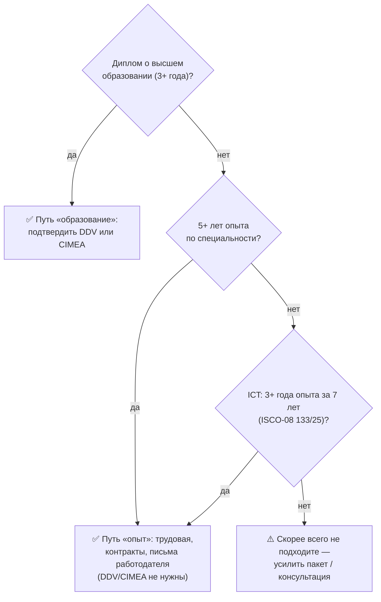

# 2. Кто может подаваться на визу цифрового кочевника

[← Обзор визы](01-overview.md) | [Семья: что учесть →](03-family-decision.md)

> **Коротко:** Нужно соответствовать 4 критериям одновременно: квалификация (диплом ИЛИ 5 лет опыта ИЛИ 3 года для IT), доход (≥24 789 EUR ИП / ≥33 500 EUR наём), 6 месяцев опыта, страховка. Самый быстрый путь — диплом + DDV.

**Содержание:**
- [Основные требования](#основные-требования)
- [Кому DN виза может не подойти](#кому-dn-виза-может-не-подойти)
- [Кто не подходит](#кто-не-подходит)
- [Важные нюансы](#важные-нюансы)

---

## Основные требования

Заявитель должен соответствовать **всем** следующим требованиям одновременно.

🟢 Decreto 29.02.2024 разделяет два статуса: **цифровой кочевник (nomade digitale)** — иностранец, осуществляющий **автономную** (самостоятельную) трудовую деятельность удалённо; **дистанционный работник (lavoratore da remoto)** — иностранец, выполняющий **подчинённую** (наёмную) работу удалённо. Условия подачи одинаковые, но пороги дохода различаются (см. раздел B). · [immigrazia_IT #2062](https://t.me/immigrazia_IT/2062) · Апрель 2024 ·

### A. Высокая квалификация

🟢 Заявитель должен быть высококвалифицированным специалистом согласно п. 1 ст. 27-quater Постановления правительства Dlg 286/98. Для подтверждения достаточно соответствовать **одному** из четырёх вариантов. · [VMS Москва](https://italy-vms.ru/documentformsk/viza-dlya-cifrovyx-kochevnikov/), [Посольство Пристина](https://ambpristina.esteri.it/en/servizi-consolari-e-visti/servizi-per-il-cittadino-straniero/visti/visto-per-nomadi-digitali-e-lavoratori-da-remoto/) · Апрель 2024 ·

#### Вариант I: Высшее образование (диплом)

🟢 Документ о высшем образовании, подтверждающий успешное окончание учебного курса длительностью **не менее 3 лет**, или курса высшего профессионального образования длительностью не менее 3 лет, или соответствующего как минимум 6 ступени Национальной структуры образовательных уровней. Подтверждается через **Dichiarazione di Valore (DDV)** или **сертификат CIMEA**. · [VMS Москва](https://italy-vms.ru/documentformsk/viza-dlya-cifrovyx-kochevnikov/) · Февраль 2026 ·

🟡 Российский диплом о высшем образовании **сам по себе может быть недостаточен** — необходимо подтверждение через DDV или CIMEA. Без этого консульство может не засчитать квалификацию. · [immigrazia_IT #2568](https://t.me/immigrazia_IT/2568), [immigrazia_IT #2569](https://t.me/immigrazia_IT/2569) · Июнь 2024 ·

🟡 Если есть диплом, это может быть самым простым путём, потому что подтверждать опыт работы без диплома кому-то может быть значительно сложнее. · [ne_putai #3564](https://t.me/ne_putai/3564) · Сентябрь 2025 ·

#### Вариант II: Регламентированная профессия

🟢 Соответствие требованиям Постановления правительства №206 от 06 ноября 2007 о ведении регламентированной трудовой деятельности. Должно быть подтверждено заранее одним из компетентных органов Италии до подачи на визу. Список регламентированных профессий: [impresainungiorno.gov.it](https://www.impresainungiorno.gov.it/en_US/web/l-impresa-e-l-europa/list-of-regulated-professions). · [VMS Москва](https://italy-vms.ru/documentformsk/viza-dlya-cifrovyx-kochevnikov/) · Февраль 2026 ·

🟡 Этот вариант выглядит малореалистично для большинства заявителей. · [ne_putai #3563](https://t.me/ne_putai/3563) · Сентябрь 2025 ·

#### Вариант III: 5+ лет профессионального опыта

🟢 Высшая профессиональная квалификация, подтверждённая **более чем 5-летним** опытом профессиональной деятельности на уровне, сравнимом с дипломом о высшем образовании, по специализации, соответствующей профессии или сфере деятельности, указанной в трудовом договоре. · [VMS Москва](https://italy-vms.ru/documentformsk/viza-dlya-cifrovyx-kochevnikov/) · Февраль 2026 ·

Необходимые документы для подтверждения:
- Регистрационные сведения об организации и информация о видах деятельности
- Информация о занимаемой должности (владелец, партнер, наёмный работник)
- Копия трудового договора и/или расчётные листки (минимум 2 за каждый год)
- Сопроводительное письмо работодателя с описанием опыта и датами

#### Вариант IV: 3+ года опыта в ICT (для айтишников)

🟢 Если заявитель является **руководителем или специалистом в сфере информационных и коммуникационных технологий** согласно Международной стандартной классификации занятости ISCO-08, № 133 и № 25 — достаточно **более чем 3 лет** соответствующего профессионального опыта, полученного **в течение 7 лет** до момента подачи. · [VMS Москва](https://italy-vms.ru/documentformsk/viza-dlya-cifrovyx-kochevnikov/), [Консульство Стамбул (PDF)](https://consistanbul.esteri.it/wp-content/uploads/2024/05/Nomade-Digitale-ITA.pdf) · Апрель 2024 ·

🟢 **ISCO-08 классификации для ИТ специалистов:**
- **[№ 133](https://www.tucareers.com/iscocareers/133)** — руководители в сфере ИКТ (ИТ директоры, начальники отделов разработки и т.д.)
- **[№ 25](https://www.tucareers.com/iscocareers/25)** — специалисты в сфере ИКТ (разработчики ПО, тестировщики, архитекторы систем, аналитики данных, системные администраторы и т.д.)

🟡 **Важно:** Указание ISCO-08 кода в трудовом договоре помогает быстрее получить одобрение, так как консульство сразу видит, что заявитель подходит под льготный режим (3 года вместо 5). · [nomadvisaitaly #8406](https://t.me/nomadvisaitaly/8406), [nomadvisaitaly #8081](https://t.me/nomadvisaitaly/8081) · Декабрь 2025 ·

🟡 **Независимое подтверждение (агентство Emigrantista):** если консульство **не зачтёт реальную профессию как IT** (например, работа не по специальности диплома), потребуется не 3-летний, а **5-летний** стаж. Это блокер, который стоит проверить до подачи. · [emigrantista #1738](https://t.me/emigrantista_answers/1738) · Май 2026 ·

🔴 **Непрофильный диплом может навредить.** Кейс отказа (Москва): бакалаврский диплom сочли непрофильным, а опыта в IT было меньше 5 лет (только 3+ года) — в отказе написали, что «не поняли, как диплом связан со специальностью». Подача «максимально полным пакетом» с непрофильным дипломом запутала консула. **Стратегия (совет консультантов):** подавать **только профильные/нужные** документы под выбранный вариант квалификации, лишнее не прикладывать, а в сопроводительном письме объяснить, почему кейс подходит под конкретный вариант, и предложить показать остальное по запросу. Профильный диплом — проще, чем доказывать опыт. · [nomadvisaitaly #11628](https://t.me/nomadvisaitaly/11628), [nomadvisaitaly #11631](https://t.me/nomadvisaitaly/11631), [nomadvisaitaly #11634](https://t.me/nomadvisaitaly/11634), [nomadvisaitaly #11638](https://t.me/nomadvisaitaly/11638) · Апрель 2026 ·

🟡 **Нужно ли показывать именно 3 года опыта — зависит от профессии и образования.** Для IT-сферы без профильного диплома опыт, как правило, обязателен, и подтвердить «реальный» опыт сверх записей в трудовой (платёжками, договорами, письмами заказчиков) удаётся не всегда — часть соискателей считает, что это не сработает. Некоторые помогаторы этот пункт в списке необходимых документов не озвучивают. · [nomadvisaitaly #13548](https://t.me/nomadvisaitaly/13548), [nomadvisaitaly #13549](https://t.me/nomadvisaitaly/13549), [nomadvisaitaly #13550](https://t.me/nomadvisaitaly/13550), [nomadvisaitaly #13551](https://t.me/nomadvisaitaly/13551) · 5 июля 2026 ·

### B. Минимальный доход

🟢 Годовой доход из законных источников не менее чем **втрое** превышающий минимальный уровень дохода для освобождения от оплаты медицинских услуг. · [VMS Москва](https://italy-vms.ru/documentformsk/viza-dlya-cifrovyx-kochevnikov/), [Декрет №24A01716](https://www.gazzettaufficiale.it/eli/id/2024/04/04/24A01716/sg) · Февраль 2026 ·

| Ситуация | Минимум | Тройной минимум |
|----------|---------|-----------------|
| Один заявитель (Digital Nomad) | 8 263 EUR | **24 789 EUR** |
| Один заявитель (наёмный работник) | 11 167 EUR | **33 500 EUR** |
| С супругом/ой | 11 362 EUR | **34 086 EUR** |
| + каждый ребёнок | +516 EUR | **+1 548 EUR** |

🟢 Для наёмных сотрудников: сумма годового дохода по трудовому договору **не может быть ниже** среднего уровня оплаты труда до уплаты налогов согласно данным ISTAT — на настоящий момент **~33 500 EUR**. Контракт должен быть на определённый срок, не менее года. · [VMS Москва](https://italy-vms.ru/documentformsk/viza-dlya-cifrovyx-kochevnikov/) · Февраль 2026 ·

🔴 **Расхождение: текст декрета vs практика ВЦ.** По самому декрету (Art. 3) порог дохода — **единый для обоих типов**: «трёхкратный минимум для освобождения от участия в расходах на здравоохранение» ≈ **24 789–28 000 EUR** (консульство Пристины прямо указывает 3 × 8 500 = **25 500 EUR**). Отдельного порога для наёмных, отсылки к ISTAT и цифры **33 500 EUR в тексте декрета нет** — это трактовка VMS Москва. Единой суммы в евро Минюст/МИД не публиковали, поэтому консульства применяют разные значения; ориентируйтесь на диапазон и уточняйте в своём консульстве. · [Декрет 29.02.2024, Art. 3](https://www.gazzettaufficiale.it/eli/id/2024/04/04/24A01716/sg), [Посольство Пристина](https://ambpristina.esteri.it/en/servizi-consolari-e-visti/servizi-per-il-cittadino-straniero/visti/visto-per-nomadi-digitali-e-lavoratori-da-remoto/) · Проверено июль 2026 ·

🟡 Помимо подтверждения дохода за прошлый год, консульство просит **выписку из банка за 3 месяца + остаток**, хотя об этом не пишут в официальных требованиях. · [ne_putai #3563](https://t.me/ne_putai/3563) · Сентябрь 2025 ·

🟡 Требования к периоду выписок **различаются по консульствам**: например, посольство Италии во Франции указывает, что достаточно банковских выписок и расчётных листков **за последние 3 месяца**, а не за год. · [rutoitalychat #60213](https://t.me/rutoitalychat/60213) · Июль 2024 ·

🟢 Для цифровых кочевников (self-employed): требуется подтверждение дохода **за предыдущий календарный год** через налоговые документы (2-НДФЛ, декларации, инвойсы, выписки из реестра). · [nomadvisaitaly #9220](https://t.me/nomadvisaitaly/9220), [nomadvisaitaly #8406](https://t.me/nomadvisaitaly/8406) · Февраль 2026 ·

🟡 **Важно (февраль 2026):** Остаток на счете **НЕ НУЖЕН в больших суммах** для Digital Nomad (и Remote Worker). Нужно подтверждение дохода на сумму не менее **8 263 × 3 = 24 789 EUR** за прошлый календарный год. **Никакого требования** к остатку в 30 000 EUR нет — это ошибочная информация. Принимают решение **сотрудники консульства**, а не визового центра. · [nomadvisaitaly #9222](https://t.me/nomadvisaitaly/9222) · Февраль 2026 ·

🟡 Выписку из банка можно прикладывать **в рублях** (или любой другой валюте). При расчёте берётся курс на дату выписки. Сбережения не обязательно должны быть в евро — валюта счета значения не имеет. · [nomadvisaitaly #9220](https://t.me/nomadvisaitaly/9220) · Февраль 2026 ·

🟡 **Суммирование доходов (найм + самозанятость, март 2026):** Если заявитель работает по найму и параллельно имеет доход как самозанятый — **можно суммировать доходы**. В выписках по самозанятости не указывается вид деятельности, поэтому можно опираться на один вид деятельности при описании. · [nomadvisaitaly #10324-10330](https://t.me/nomadvisaitaly/10324) · Март 2026 ·

🟡 Минимальный годовой доход — тройной размер минимума, освобождающего от участия в расходах на здравоохранение (~8 263 × 3 ≈ 25 000 EUR). Некоторые источники пишут **28 000 EUR/год**. На практике видно, что принимают от ~25 000 EUR. Официально требуется 24 789 EUR. · [nomadvisaitaly #595](https://t.me/nomadvisaitaly/595), [nomadvisaitaly #4220](https://t.me/nomadvisaitaly/4220), [nomadvisaitaly #9220](https://t.me/nomadvisaitaly/9220) · Апрель 2024 — Февраль 2026 ·

🟡 **Для самозанятых / ИП:** Налоговые декларации можно показать только за **последний год** (или даже полгода). Однако для подтверждения опыта и квалификации надо показать трудоустройство и работу по профессии — **за 5 лет**, или **3 года для ИТ специалистов (ISCO-08 #133, #25)** — чтобы доказать экспертизу. Диплом подходит как доказательство квалификации и может заменить требование опыта. · [nomadvisaitaly #9263](https://t.me/nomadvisaitaly/9263), [nomadvisaitaly #8406](https://t.me/nomadvisaitaly/8406) · Февраль 2026 ·

### C. Опыт работы

🟢 Предыдущий опыт работы **не менее 6 месяцев** в сфере соответствующей специализации трудовой деятельности в качестве цифрового кочевника или удалённого сотрудника. · [VMS Москва](https://italy-vms.ru/documentformsk/viza-dlya-cifrovyx-kochevnikov/), [Посольство Пристина](https://ambpristina.esteri.it/en/servizi-consolari-e-visti/servizi-per-il-cittadino-straniero/visti/visto-per-nomadi-digitali-e-lavoratori-da-remoto/) · Апрель 2024 ·

🔴 Не ясно, должен ли этот опыт быть именно в удалённом формате. Автор @ne_putai считает, что не обязательно, но на всякий случай подтверждает удалённый формат где может. · [ne_putai #3563](https://t.me/ne_putai/3563) · Сентябрь 2025 ·
🟡 **Важно:** В трудовом договоре должно быть явно указано, что работа **удалённая** или проводится **вне офиса**. Без этого могут возникнуть вопросы. Если в договоре этого не сказано, рекомендуется приложить письмо от работодателя с уточнением о дистанционной работе. · [nomadvisaitaly #9220](https://t.me/nomadvisaitaly/9220), [nomadvisaitaly #9356](https://t.me/nomadvisaitaly/9356) · Февраль 2026 ·

🟡 **Альтернатива:** Если опыт есть только очный, но у заявителя есть диплом, опыт можно не требовать (диплом часто заменяет требование по опыту). · [nomadvisaitaly #8406](https://t.me/nomadvisaitaly/8406) · Декабрь 2025 ·

### D. Медицинская страховка

🟢 Медицинская страховка для получения медицинской помощи, **в том числе в стационаре**, на территории Италии на весь период пребывания. · [VMS Москва](https://italy-vms.ru/documentformsk/viza-dlya-cifrovyx-kochevnikov/) · Февраль 2026 ·

### E. Жильё

🟢 Соответствующие документы, подтверждающие наличие надлежащего жилья. · [VMS Москва](https://italy-vms.ru/documentformsk/viza-dlya-cifrovyx-kochevnikov/) · Февраль 2026 ·

🟢 В консульстве Пристина указано: «rental contract registered with the Revenue Agency or a property ownership document» (контракт аренды, зарегистрированный в налоговой, или документ о собственности). · [Посольство Пристина](https://ambpristina.esteri.it/en/servizi-consolari-e-visti/servizi-per-il-cittadino-straniero/visti/visto-per-nomadi-digitali-e-lavoratori-da-remoto/) · 2024 ·

🟡 В Москве достаточно показать букинг/Airbnb на 3 месяца или приглашение (ospitalità). Подробнее на [сайте VMS](https://italy-vms.ru/priglashenie-ili-bron-otelya/). В Белграде требуют контракт аренды на год, зарегистрированный в налоговой. Требования **различаются по консульствам**. · [ne_putai #3563](https://t.me/ne_putai/3563), [nomadvisaitaly #4144](https://t.me/nomadvisaitaly/4144), [nomadvisaitaly #5038](https://t.me/nomadvisaitaly/5038) · 2024–2025 ·

## Кому DN виза может не подойти

🟡 **Блогеры и инфлюенсеры:** Виза цифрового кочевника для них проблематична — нужен подтверждённый опыт как самозанятого или удалёнщика, высшее образование или 5–7 лет опыта по контрактам, действующий договор. Виза фрилансера (lavoro autonomo) может подойти лучше: ниже требования к доходу (~8 400 EUR/год), проще с контрактами. · [immigrazia_IT #3872–3886](https://t.me/immigrazia_IT/3872) · Ноябрь 2024 ·

## Кто не подходит

🟢 Занятость должна быть для **высококвалифицированного** специалиста в соответствии со ст. 27-quater. Неквалифицированный труд не подходит. · [Brocardi.it — Art. 27-quater](https://www.brocardi.it/testo-unico-immigrazione/titolo-iii/art27quater.html) · 2024 ·

🟡 Справка о несудимости **не нужна** для DN (в отличие от lavoro autonomo). · [nomadvisaitaly #998](https://t.me/nomadvisaitaly/998), [nomadvisaitaly #810](https://t.me/nomadvisaitaly/810) · Апрель 2024 ·

## Важные нюансы

🟡 Шансы выше, если вы едете с контрактом на руках, которому уже есть хотя бы несколько месяцев, а срок его окончания существенно позже, чем срок визы — т.е. заключённый хотя бы на 2–3 года (а лучше бессрочный). Если контракт на год, хорошо иметь справку от работодателя о намерении продлить. · [ne_putai #3563](https://t.me/ne_putai/3563) · Сентябрь 2025 ·

🟡 Можно подаваться без непосредственно контракта, а с обязывающим договором о намерении заключить контракт (binding offer), но это сложнее и лучше проконсультироваться со специалистом. · [ne_putai #3563](https://t.me/ne_putai/3563) · Сентябрь 2025 ·

🟢 Работодатель/заказчик может быть как итальянским, так и иностранным юридическим лицом. Текст декрета прямо это допускает: «*…attraverso l'utilizzo di strumenti tecnologici che consentono di lavorare da remoto, in via autonoma ovvero per un'impresa **anche non residente** nel territorio nazionale*» — работать можно самостоятельно (ИП) либо на компанию, в том числе **не** зарегистрированную в Италии. · [VMS Москва](https://italy-vms.ru/documentformsk/viza-dlya-cifrovyx-kochevnikov/), [rutoitalychat #127762](https://t.me/rutoitalychat/127762), [rutoitalychat #127768](https://t.me/rutoitalychat/127768) · Февраль–июнь 2026 ·

🔴 **Нюанс: работа на итальянскую компанию может быть расценена как lavoro subordinato.** Формально DN может работать и на итальянскую компанию, но квестура может счесть это обычным наёмным трудом (lavoro subordinato), независимо от удалённого формата. Однозначной трактовки у участников чата нет — вопрос остаётся «живым». · [rutoitalychat #127825](https://t.me/rutoitalychat/127825), [rutoitalychat #127827](https://t.me/rutoitalychat/127827) · Июнь 2026 ·

🟢 Въездная виза для DN/remote worker должна быть **использована в течение 180 дней** с даты выдачи (ст. 26.7 Сводного закона об иммиграции). · [immigrazia_IT #4902–4904](https://t.me/immigrazia_IT/4902) · Май 2025 ·

---

[← Обзор визы](01-overview.md) | [Семья: что учесть →](03-family-decision.md)
