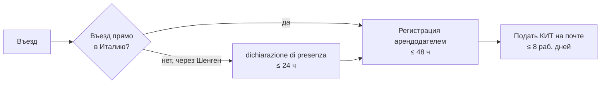

# 12. Первые шаги в Италии (дедлайны!)

[← Подача и получение визы](11-application.md) | [Обустройство →](13-settling-in.md)

> **Коротко:** В первые 8 дней после приезда нужно подать КИТ на почте. Если въехали не через Италию — dichiarazione di presenza в квестуре в течение суток. Далее — ждать вызова в квестуру на биометрию. ⚠️ С мая 2026 виза D **больше не гарантирует ВНЖ**: появился первый отказ в ВНЖ по DN (Верона), некоторые квестуры повторно проверяют основания визы — сохраняйте копии всего пакета, поданного на визу.
>
> **Срочно:** КИТ = 8 рабочих дней. Dichiarazione di presenza = 24 часа.

**Содержание:**
- [Общая последовательность действий](#общая-последовательность-действий)
- [Шаг 1: Регистрация арендодателем (8 дней)](#шаг-1-регистрация-арендодателем-8-дней)
- [Шаг 2: Подача KIT на почте (8 дней)](#шаг-2-подача-kit-на-почте-8-дней)
- [Шаг 3: Квестура — отпечатки и ожидание ВНЖ](#шаг-3-квестура--отпечатки-и-ожидание-внж)
- [Соглашение об интеграции и языковой тест A2](#соглашение-об-интеграции-и-языковой-тест-a2)

---

## Общая последовательность действий



🟡 Весь процесс от приезда до открытия ИП занимает **от 3 месяцев** (если всё идеально и повезло) до **полугода** в хорошем случае, и до бесконечности «если произошла Италия». По слухам, номадам стараются побыстрее сделать вещи, касающиеся ВНЖ. Скорость обработки сильно варьируется по городам. · [ne_putai #3567](https://t.me/ne_putai/3567), [nomadvisaitaly #1414](https://t.me/nomadvisaitaly/1414) · Сентябрь 2025 – Ноябрь 2025 ·

```
День 1–8:
├── Арендодатель регистрирует вас в иммиграционной полиции
└── Подача KIT на почте

Месяц 1–3:
├── Ожидание даты посещения квестуры
├── Посещение квестуры (отпечатки)
├── Подача на residenza (прописку) — можно параллельно
└── Ожидание пластикового ВНЖ

Месяц 3–6:
├── Получение пластика ВНЖ
├── Получение residenza
├── Получение Codice Fiscale (обычно вместе с ВНЖ)
├── Получение Carta di Identità (CIE)
├── Открытие банковского счёта
└── Регистрация ИП (Partita IVA) + regime forfettario
```

## Шаг 1: Регистрация арендодателем (8 дней)

🟡 Арендодатель регистрирует вас в иммиграционной полиции в течение **8 дней** после вашего приезда. · [ne_putai #3567](https://t.me/ne_putai/3567) · Сентябрь 2025 ·

🟢 **Dichiarazione di presenza (декларация присутствия):** Если у вас виза D и вы пересекли границу ЕС **не через Италию** (т.е. нет итальянского штампа в паспорте), необходимо **в течение суток** после приезда в Италию отметиться в квестуре — подать dichiarazione di presenza. После неё подаётся KIT. · [rutoitalychat #1524](https://t.me/rutoitalychat/1524) · Апрель 2023 ·

🟡 **Уведомление о заселении (в течение 48 часов).** О месте проживания сообщается в квестуру в течение 48 часов после заселения: **отель** делает это автоматически; при **аренде** напомните хозяину (не все знают это правило); если живёте **у друзей** — они заполняют бланк и передают в квестуру. · [nomadvisaitaly #11547](https://t.me/nomadvisaitaly/11547), [nomadvisaitaly #11549](https://t.me/nomadvisaitaly/11549) · Апрель 2026 ·

## Шаг 2: Подача KIT на почте (8 дней)

🟢 Вид на жительство (permesso di soggiorno) запрашивается непосредственно в полицейском управлении (Квестуре) в течение **8 рабочих дней** с момента въезда. Для запроса предоставляется тот же пакет документов, что и при подаче на визу, **предварительно заверенный** консульством. · [VMS Москва](https://italy-vms.ru/documentformsk/viza-dlya-cifrovyx-kochevnikov/) · Февраль 2026 ·

🟡 Подача KIT (комплекта документов на ВНЖ) производится **на почте** (Poste Italiane). Конверт KIT можно взять бесплатно на почте. Стоимость: примерно **120 EUR**. В Милане, Генуе, Савоне — подача через почту. · [ne_putai #3567](https://t.me/ne_putai/3567), [nomadvisaitaly #6838](https://t.me/nomadvisaitaly/6838) · Сентябрь 2025 ·

🟡 При подаче KIT в **разных отделениях почты** могут быть разные требования к оплате. Стоимость выглядит как сумма всех компонентов: permesso (~116,46 EUR), stampa, продукты и прочее. Рекомендуется уточнить точную сумму при подаче. · [nomadvisaitaly #7185](https://t.me/nomadvisaitaly/7185) · Октябрь 2025 ·

🟢 **Подача напрямую в квестуру (по закону):** Согласно закону (Art. 5, comma 2 TUI 286/98), permesso di soggiorno можно запрашивать **напрямую в квестуре**, минуя почту. Однако на практике квестуры к этому не готовы — большинство заявителей DN подают через почту (KIT). Вопрос о прямой подаче для DN периодически поднимается, но успешных кейсов мало. · [rutoitalychat #77140](https://t.me/rutoitalychat/77140), [rutoitalychat #114867](https://t.me/rutoitalychat/114867) · Ноябрь 2024 – Ноябрь 2025 ·

🟡 Отправить KIT можно **с букингом**, а уже на отпечатки принести **контракт или оспиталиту**. На поиск жилья — от 2 до 6 месяцев в зависимости от города. · [nomadvisaitaly #7034](https://t.me/nomadvisaitaly/7034) · Сентябрь 2025 ·

🟡 **КИТ можно подать в любом городе, но аппунтаменто будет по адресу в Италии.** Система назначит квестуру района/города, указанного как адрес проживания. В **крупных городах (Милан)** букинг-адрес теперь нежелателен: если на отпечатки принести контракт из другого муниципалитета, чем при подаче, отпечатки могут **перенести** в квестуру по новому адресу (потеря времени) — теперь сразу спрашивают контракт/оспиталиту. В малых городах с одной квестурой на район адрес не критичен. · [nomadvisaitaly #11849](https://t.me/nomadvisaitaly/11849), [nomadvisaitaly #11856](https://t.me/nomadvisaitaly/11856), [nomadvisaitaly #12488](https://t.me/nomadvisaitaly/12488) · Май–июнь 2026 ·

🟡 **Итальянский номер телефона для KIT:** При подаче KIT важно указать итальянский номер — на него придёт SMS с датой отпечатков и уведомление о готовности пермессо. Рекомендуется заранее оформить итальянскую SIM-карту (для которой нужен codice fiscale). · [rutoitalychat #110439](https://t.me/rutoitalychat/110439) · Сентябрь 2025 ·

🟡 На почте могут возникнуть проблемы: человек на почте порвал конверт, пытаясь запихать пачку бумаги. На одной почте нет конвертов KIT, на другой — бумаги для ричевуты (квитанции), на третьей — сломан терминал для записи в очередь. Берите запасной конверт! · [ne_putai #3593](https://t.me/ne_putai/3593) · Ноябрь 2025 ·

🟡 Стоимость permesso: ~**116,46 EUR** (оплата на почте + produzione + marca da bollo). · [nomadvisaitaly #7185](https://t.me/nomadvisaitaly/7185) · Октябрь 2025 ·

🟡 **Детальный разбор стоимости КИТ (апрель 2026):** пересылка Poste Italiane — **30€**; bollettino (30,36 + 40,00) — **70,46€**; marca da bollo — **16€**; сервисный сбор почты — **~2€** (в Савоне). Итого **~118€**. Расценки: [portaleimmigrazione.it/ITA/tabelleCosti.html](https://www.portaleimmigrazione.it/ITA/tabelleCosti.html). · [nomadvisaitaly #11117](https://t.me/nomadvisaitaly/11117), [nomadvisaitaly #11118](https://t.me/nomadvisaitaly/11118) · Апрель 2026 ·

🟡 **Совет: если нет привязки к городу, подавать КИТ в Милане.** В Милане сроки от подачи до пластика — 2–3 месяца. В Генуе — 3–5 мес на отпечатки, практика может тянуться 11+ мес. После получения ВНЖ можно переехать, сделать резиденцу и CIE в нужном городе. Исключение: семьи с детьми в школе привязаны к месту проживания. · [nomadvisaitaly #11225](https://t.me/nomadvisaitaly/11225), [nomadvisaitaly #11229](https://t.me/nomadvisaitaly/11229) · Апрель 2026 ·

### KIT: тип пермессо в анкете

🟡 В анкете KIT в поле «Codice Tipologia Permesso» (п. 16) для Digital Nomad указывается код **«15 Lavoro Autonomo»**. · [nomadvisaitaly #7022](https://t.me/nomadvisaitaly/7022) · Сентябрь 2025 ·

### KIT: Модуль 2 — как заполнять без Partita IVA

🟡 **Модуль 2 нужно подавать.** Обе стороны дискуссии в чате согласны — модуль 2 подаётся. Спор только о том, **насколько подробно заполнять**, если у DN ещё нет Partita IVA и Codice Fiscale. · [nomadvisaitaly #11032](https://t.me/nomadvisaitaly/11032), [nomadvisaitaly #11040](https://t.me/nomadvisaitaly/11040) · Апрель 2026 ·

**Что заполнять минимально:** Поставить галочку «автономная работа» (autonomo). Для DN нет отдельной инструкции к КИТ — ориентироваться на инструкцию для lavoro autonomo. Даже если нет номера Partita, обозначить род будущей деятельности. · [nomadvisaitaly #11032](https://t.me/nomadvisaitaly/11032), [nomadvisaitaly #11056](https://t.me/nomadvisaitaly/11056), [nomadvisaitaly #11084](https://t.me/nomadvisaitaly/11084) · Апрель 2026 ·

**⚠️ Не указывайте «деятельность начата в этом году», если Partita не открыта.** Практический пример риска (Милан): DN поставил эту галочку в модуле 2, но открыть Partita IVA без Codice и ВНЖ не мог. На отпечатках квестура спросила: «где Partita? Вы же указали, что деятельность начата». · [nomadvisaitaly #11083](https://t.me/nomadvisaitaly/11083) · Апрель 2026 ·

**Независимое подтверждение (канал immigrazia_IT):** Детальный пост — модуль 2 нужно заполнять. Без него — формально недостаток документов, квестура может отклонить. · [immigrazia_IT #6797](https://t.me/immigrazia_IT/6797) · Апрель 2026 ·

## Шаг 3: Квестура — отпечатки и ожидание ВНЖ

🟡 После подачи KIT назначают дату посещения квестуры. В **Милане** — через **1–2 месяца**. В Венеции — запись через **год** (!). В **Турине** — ожидание отпечатков после KIT составляет **~6 месяцев**. · [ne_putai #3567](https://t.me/ne_putai/3567), [nomadvisaitaly #688](https://t.me/nomadvisaitaly/688), [nomadvisaitaly #7802](https://t.me/nomadvisaitaly/7802) · 2024–2025 ·

🟡 В Милане назначили посещение квестуры на Porta Genova через **5 недель** после подачи KIT. · [ne_putai #3593](https://t.me/ne_putai/3593) · Ноябрь 2025 ·

### Что происходит в квестуре

🟡 **Что нести в квестуру (KIT и документы):** В KIT при отправке по почте кладётся копия паспорта и визы (как основание получения пермессо). **Основной пакет документов** из консульства (который вернули сшитым) несут уже лично на отпечатки, а не вкладывают в конверт. Поскольку конверт KIT вскрывают именно при визите в квестуру — можно часть документов принести тогда же. · [nomadvisaitaly #8075](https://t.me/nomadvisaitaly/8075), [nomadvisaitaly #8085](https://t.me/nomadvisaitaly/8085) · Декабрь 2025 ·

🟡 Консульство возвращает один комплект документов **сшитым с пометками карандашом** — именно он предназначен для квестуры. Если консульство (как в Белграде) не вернуло документы, придётся собирать комплект для квестуры заново. · [nomadvisaitaly #8005](https://t.me/nomadvisaitaly/8005), [nomadvisaitaly #8318](https://t.me/nomadvisaitaly/8318) · Ноябрь–Декабрь 2025 ·

🔴 **Проблема с квестурой при отсутствии второго комплекта (март 2026, Рим/Остия):** Заявитель получил визу через Казахстан. Консульство КЗ **не вернуло** второй комплект документов (как и в Армении — возвращают только паспорт). Квестура Остии потребовала документы, «которые видели в консульстве» (т.е. сшитый комплект с печатями), и **развернула заявителя**. Проблема: заверенные консульством копии с печатями не признали достаточными. История с двумя прошитыми комплектами — практика **только Москвы**. Из Казахстана и Армении приходится объяснять, что второго комплекта не бывает. Рекомендуется **написать консульству** с просьбой подтвердить выдачу визы, а также обращаться в **центральную квестуру** города. · [nomadvisaitaly #10599-10665](https://t.me/nomadvisaitaly/10599) · Март 2026 ·

🟡 Квестуру интересовали **только**: паспорт, ричевута, сертификат из консульства, арендный контракт и одна фотография. Вся прошитая намоленная пачка документов из консульства — не понадобилась. Чел сказал «мамма мия» и отдал пачку обратно. · [ne_putai #3961](https://t.me/ne_putai/3961) · Декабрь 2025 ·

🟡 Квестура попросила «nulla osta» (разрешение от префектуры по квотам). Автор объяснил, что для номадов DN nulla osta **не нужна**. Сотрудник записал себе на листочке новую категорию. **Никто ничего не знает про цифровых кочевников** — виза новая. · [ne_putai #3961](https://t.me/ne_putai/3961) · Декабрь 2025 ·

### Процедура снятия отпечатков (биометрия)

🟡 При снятии отпечатков пальцев в квестуре указываются: рост, цвет волос и глаз, информация о татуировках. В процессе проверяют практику и могут указать недостатки документов. · [nomadvisaitaly #8677](https://t.me/nomadvisaitaly/8677) · Январь 2026 ·

🟡 В некоторых местах (Турин, Генуя) снимают отпечатки тщательно и долго, включая ладони. Процедура может длиться около **10 минут**. · [nomadvisaitaly #8727](https://t.me/nomadvisaitaly/8727) · Январь 2026 ·

🟡 Пластиковая карта ВНЖ запрашивается **только после снятия отпечатков** (биометрии). · [nomadvisaitaly #8677](https://t.me/nomadvisaitaly/8677) · Январь 2026 ·

🟡 Квестуры не всегда понимают, как обрабатывать DN — бланки не обновлены, возможны задержки и «аномалии в документах». В одном маленьком городе на севере заявили, что заявка «заблокирована» и нужно идти в Префектуру. Со ссылками на законы удалось доказать, что это неправомерно — при повторном визите документы приняли. **Рекомендация:** иметь при себе распечатку соответствующих статей закона (DM 29 февраля 2024). · [nomadvisaitaly #3687](https://t.me/nomadvisaitaly/3687), [nomadvisaitaly #7014](https://t.me/nomadvisaitaly/7014), [emigrantista #1641](https://t.me/emigrantista_answers/1641) · 2024–2025 ·

🟡 ⚠️ **Виза D больше НЕ является гарантией ВНЖ (обновление, май 2026).** До весны 2026 не было зафиксировано ни одного отказа в ВНЖ при наличии визы D для DN — по состоянию на **март 2026** действовало правило «виза D = фактически гарантия ВНЖ» (если соблюдены 8 дней на КИТ и документы в порядке). Но в **мае 2026 появился первый документированный отказ в ВНЖ по DN уже после въезда**: квестура Вероны (наёмный DN, дозапрос паспорта гендиректора компании, предоставить который невозможно → окончательный отказ + foglio di via, см. [кейс Marina Karapetian](18-cases.md#отказ-в-внж-dn--квестура-верона-наёмный-яндекс-дозапрос-паспорта-гендиректора-marina-karapetian)). Виза D по-прежнему даёт право на запрос ВНЖ, но формальная негарантированность перестала быть только формальностью. · [nomadvisaitaly #9997](https://t.me/nomadvisaitaly/9997) (актуально до мая 2026), [rutoitalychat #126552](https://t.me/rutoitalychat/126552), [rutoitalychat #126579](https://t.me/rutoitalychat/126579) · Март–май 2026 ·

🔴 **Некоторые квестуры повторно проверяют основания визы на этапе ВНЖ.** Известно ≥4 историй с дозапросом актуальной информации по работе и доходу у DN уже после выдачи визы. Отдельный риск: ряд квестур (например, **Рим**) требует приложить в КИТ копии всех документов, поданных на визу, **с отметкой консульства** — а консульство (например, **Астана**) могло их не вернуть, что создаёт замкнутый круг (см. [кейс Alisa Dyuchkova](18-cases.md#проблема-с-внж-dn--консульство-астаны-не-отдало-документы-квестура-рима-требует-alisa-dyuchkova) и [кейс #34](18-cases.md#проблемы-с-внж-dn--казахстан--квестура-рим-запрос-документов-через-6-месяцев)). Консультанты называют **Верону, Падую и Парму** проблемными квестурами для DN. **Совет:** сохраняйте копии всего пакета, поданного на визу (по возможности — с отметкой консульства). · [rutoitalychat #126713](https://t.me/rutoitalychat/126713), [rutoitalychat #126777](https://t.me/rutoitalychat/126777), [rutoitalychat #126588](https://t.me/rutoitalychat/126588) · Май 2026 ·

### Проблемы с квестурой

🟡 Документы «подвисли» в недрах квестуры — перенесли встречу. При повторном визите квестура «потеряла» документы, но нашла за 15 минут. Совет: **следите за документами**, не отдавайте оригиналы без необходимости. · [ne_putai #3780](https://t.me/ne_putai/3780), [ne_putai #3961](https://t.me/ne_putai/3961) · Декабрь 2025 ·

🟡 **Кейс Милан, январь 2026**: KIT подан 24 декабря → отпечатки назначены на 21 января. В квестуре (Porta Genova) одному заявителю сказали «**практика заблокирована**» (документы «не доехали с почты»), назначили новую дату через 3 недели. Мужу — «практика не заблокирована, подождите 5 минут». Прождали 1,5 часа, но в итоге муж сдал отпечатки. · [nomadvisaitaly #8870](https://t.me/nomadvisaitaly/8870) · Январь 2026 ·

🟡 **В Милане 3 почты не приняли KIT**: одна закрылась на Рождество перед носом, две сказали «чего-то у нас нет — приходите после праздников». В четвёртой спокойно приняли. Совет: **ходите по нескольким почтам**, если в первой отказали. · [nomadvisaitaly #8363](https://t.me/nomadvisaitaly/8363) · Декабрь 2025 ·

🟡 В **Лекко** (север Италии): KIT подан, дату на отпечатки назначили через **5 месяцев** (!). Совет от сотрудника почты: прийти в квестуру лично и попросить передвинуть — «система даёт одно, а квестура может предложить другие даты». · [nomadvisaitaly #8941](https://t.me/nomadvisaitaly/8941) · Январь 2026 ·

🟡 Реальность венецианской квестуры: при подаче на **продление ВНЖ** в январе 2024 получил запись на посещение квестуры **на январь 2025** — через год! И это ещё не карточка, а только визит. · [nomadvisaitaly #688](https://t.me/nomadvisaitaly/688) · Апрель 2024 ·

🟡 В Италии сложно что-то планировать, нужно уметь двигаться «по обстоятельствам». Берите с собой **вообще все документы, которые есть** — как маг и волшебник доставайте их «из рукава» при необходимости. Потому что могут запросить копию чего угодно, даже если вы это вкладывали в KIT. · [nomadvisaitaly #7101](https://t.me/nomadvisaitaly/7101), [nomadvisaitaly #9563](https://t.me/nomadvisaitaly/9563) · 2025–2026 ·

### Сроки по городам (сводка)

🟡 Известные сроки ожидания отпечатков после подачи KIT:
— **Милан**: ~1–2 месяца (один из самых быстрых городов)
— **Генуя**: ~3–5 месяцев (в апреле 2026 дату назначили через 3 мес; в 2025 году — через 5 мес; практика может оставаться «в работе» 11+ мес)
— **Лекко**: ~5 месяцев (дата из системы; квестура может перенести на более раннее — стоит спросить лично)
— **Турин**: ~6 месяцев (стандартная очередь)
— **Венеция**: до 1 года (на продление)
— **Сардиния (Nuoro)**: ~2 месяца (первичная подача); при продлении — отпечатки могут назначить уже через **~2 недели** после KIT
— **Малые города / острова**: по слухам, можно получить пластик за 3 месяца, если город совсем непопулярный
· [nomadvisaitaly #6907](https://t.me/nomadvisaitaly/6907), [nomadvisaitaly #7802](https://t.me/nomadvisaitaly/7802), [nomadvisaitaly #8941](https://t.me/nomadvisaitaly/8941), [nomadvisaitaly #5349](https://t.me/nomadvisaitaly/5349), [nomadvisaitaly #1414](https://t.me/nomadvisaitaly/1414), [rutoitalychat #49518](https://t.me/rutoitalychat/49518), [nomadvisaitaly #11222](https://t.me/nomadvisaitaly/11222), [nomadvisaitaly #11224](https://t.me/nomadvisaitaly/11224) · 2024–2026 ·

🟡 **Свежие кейсы сроков (2026):**
— **Бергамо:** КИТ октябрь 2025 → отпечатки январь 2026 → пластик начало июня 2026 (~8 месяцев всего). Тип в пермессо — «nomade digit - lav remoto», срок до марта 2027. СМС о готовности не приходило — статус узнавали запросами по PEC. [Кейс Dmitry](18-cases.md#внж-dn-бергамо--пермессо-за-8-месяцев-кит-окт-2025--пластик-июнь-2026-dmitry).
— **Верчелли:** КИТ 04.06.2026 → отпечатки назначены на 07.10.2026 (~4 месяца до отпечатков). [Кейс Anna Kristina](18-cases.md#dn-виза-22-дня--кит-верчелли-отпечатки-через-4-месяца-anna-kristina).
— **Лекко:** дружелюбная квестура, отпечатки приняли сразу, попросили договор аренды и продлить страховку; карточку обещали через 1–2 месяца (максимум). [Кейс Kseniia](18-cases.md#квестура-лекко--отпечатки-dn-дружелюбный-приём-карточка-за-12-месяца-kseniia).
— **Варезе (Varese):** подача на ВНЖ (DN) 8 июня 2026 → дата на отпечатки пальцев — 23 июня (~2 недели). [immigrazia_IT #7233](https://t.me/immigrazia_IT/7233).
· [nomadvisaitaly #12629](https://t.me/nomadvisaitaly/12629), [nomadvisaitaly #12634](https://t.me/nomadvisaitaly/12634), [nomadvisaitaly #12346](https://t.me/nomadvisaitaly/12346), [immigrazia_IT #7233](https://t.me/immigrazia_IT/7233) · Май–июнь 2026 ·

🟡 **Турин — сроки зависят от типа ВНЖ:** студенческий — через ~6 месяцев, ожидание занятости — через ~8 месяцев, рабочий — через ~4 месяца. DN предположительно ближе к рабочему типу. · [rutoitalychat #109870](https://t.me/rutoitalychat/109870) · Сентябрь 2025 ·

🟡 **От отпечатков до пластиковой карты ВНЖ:**
— **Север Италии**: ~2 недели после биометрии
— **Милан**: до 45 дней, обычно ~5 недель
— **Юг Италии**: более длительные сроки
· [nomadvisaitaly #6365](https://t.me/nomadvisaitaly/6365), [nomadvisaitaly #4437](https://t.me/nomadvisaitaly/4437) · 2025 ·

🟡 **Рим**: квестура может выдать пластиковый ВНЖ **с уже истёкшим сроком действия** (просроченный на момент выдачи). · [nomadvisaitaly #6907](https://t.me/nomadvisaitaly/6907) · Сентябрь 2025 ·

🟡 **Сроки готовности/выдачи пермессо по городам (июль 2026):**
— **Милан:** один из самых быстрых — отпечатки через пару месяцев от КИТ, ~месяц до готовности пластика. На продление можно подавать за 60 дней до окончания. Свежий кейс продления: подала 25 июня → отпечатки 10 июля. Быстрые комиссариаты есть и внутри Милана.
— **Верона:** отпечатки дали через месяц (подача 18.03.2025), но **забрать** пермессо можно только по аппунтоменто, которое берёшь сам, — ближайшее было через **5 месяцев**.
— **Монца:** пермессо ждут и **полтора–два года**.
— **Савона:** около **12 месяцев**.
— **Генуя:** инспектор говорил, что бывает и **2 года** (по кейсу — ~8 месяцев); «на юге и год ждут».
— **Рива-дель-Гарда** (комиссариат, провинция Тренто): быстрый — **3–4 недели** до отпечатков и **2 недели** до готовности; при этом главная квестура Тренто и квестура Больцано — небыстрые.
— **Быстрее среднего** (по опыту консультанта): Милан, **Варезе**, **Дезенцано** (местный комиссариат), **Кунео**, небольшие коммуны; на **Сицилии** недолго. **Медленно:** Турин, Генуя, Верона, Монца, Больцано, Савона, **Сардиния**, Рим.
· [nomadvisaitaly #13480](https://t.me/nomadvisaitaly/13480), [nomadvisaitaly #13482](https://t.me/nomadvisaitaly/13482), [nomadvisaitaly #13484](https://t.me/nomadvisaitaly/13484), [nomadvisaitaly #13517](https://t.me/nomadvisaitaly/13517), [nomadvisaitaly #13559](https://t.me/nomadvisaitaly/13559), [nomadvisaitaly #13647](https://t.me/nomadvisaitaly/13647), [nomadvisaitaly #13654](https://t.me/nomadvisaitaly/13654), [nomadvisaitaly #13656](https://t.me/nomadvisaitaly/13656), [nomadvisaitaly #13805](https://t.me/nomadvisaitaly/13805) · Июль 2026 ·

🟡 **Кейс DN, малый город, октябрь 2025**: Подала документы в мае, отпечатки взяли **сразу при подаче**. Квестура дозапросила справки через PEC. Через 5 месяцев ВНЖ всё ещё не выдан — рассмотрение «на паузе», инспектор не дошёл до дозапрошенных документов. Юрист написал формальный солечито (sollecito) через PEC. Рекомендация: **дублировать письма через PEC регулярно**. · [rutoitalychat #112074](https://t.me/rutoitalychat/112074) · Октябрь 2025 ·

🟡 **Флоренция**: в некоторых случаях дата посещения квестуры **не назначается сразу на почте** — приходит позже по SMS. · [nomadvisaitaly #6864](https://t.me/nomadvisaitaly/6864) · Сентябрь 2025 ·

🟡 **Бергамо**: квестура для жителей района Бергамо может оказаться в **Курно** (Curno), а не в самом Бергамо — зависит от адреса. При подаче KIT указанный адрес определяет, в какую квестуру попадёт дело. · [nomadvisaitaly #7131](https://t.me/nomadvisaitaly/7131) · Октябрь 2025 ·

### Смена квестуры и переезд

🟡 Если вы уже отправили KIT, но хотите **сменить квестуру** (переехали в другой город): нужно писать письмо на почту квестуры — это «лотерея». Риск потери документов. · [nomadvisaitaly #6861](https://t.me/nomadvisaitaly/6861), [nomadvisaitaly #8196](https://t.me/nomadvisaitaly/8196) · 2025 ·

🟡 При **переезде после получения ВНЖ** необходимо **уведомить квестуру** о смене адреса регистрации и обновить адрес во всех документах — иначе могут возникнуть вопросы при продлении. · [nomadvisaitaly #8212](https://t.me/nomadvisaitaly/8212) · Декабрь 2025 ·

### Выезд из Италии в ожидании ВНЖ

🟡 **Пока действует виза D** — можно свободно въезжать и выезжать из Италии. После истечения визы D, если пермессо ещё не получен, выехать можно, но **обратный въезд — риск**. По закону для обратного въезда нужна виза реингрессо (visto di reingresso), но на практике люди с ричевутой иногда проходили границу. На ричевуте с недавнего времени указывают срок действия, что дополнительно усложняет ситуацию. **Рекомендация:** планировать все поездки на период действия визы D. · [rutoitalychat #100588](https://t.me/rutoitalychat/100588), [rutoitalychat #106369](https://t.me/rutoitalychat/106369) · Июнь–Август 2025 ·

🟡 **При ожидании ПЕРВОГО пермессо после истечения визы D — вы фактически заперты в стране.** Авиакомпании не сажают на обратный рейс: к почтовой квитанции требуют либо просроченный пермессо, либо действующую визу D. Кому-то везло пройти только с бумагой об ожидании ВНЖ, но чаще — не пускают на рейс. По Шенгену без действующего пермессо передвигаться нельзя. Это одна из причин делать первый пакет документов через быструю квестуру (Милан), чтобы не «застрять». · [nomadvisaitaly #13577](https://t.me/nomadvisaitaly/13577), [nomadvisaitaly #13595](https://t.me/nomadvisaitaly/13595), [nomadvisaitaly #13819](https://t.me/nomadvisaitaly/13819) · Июль 2026 ·

🟡 **При ПРОДЛЕНИИ (не первый пермессо) выезжать можно** — но по Шенгену без действующего пластика передвигаться нельзя, а с просроченным пермессо + ричевутой о подаче на продление выехать/въехать реально. · [nomadvisaitaly #13578](https://t.me/nomadvisaitaly/13578), [nomadvisaitaly #13819](https://t.me/nomadvisaitaly/13819) · Июль 2026 ·

🟡 **При втором и последующих въездах по действующей визе D** на границе могут попросить **ричевуту** (почтовую квитанцию о подаче КИТ) в дополнение к визе — из-за обязательства подать КИТ в течение 8 дней после первого въезда. Если в паспорте уже есть штампы въезда по визе D — возите ричевуту с собой. · [nomadvisaitaly #13603](https://t.me/nomadvisaitaly/13603), [nomadvisaitaly #13608](https://t.me/nomadvisaitaly/13608) · Июль 2026 ·

🔴 **Ключевой нюанс: ricevuta di rinnovo (о продлении) ≠ ricevuta di primo rilascio (о первом пермессо).** По официальному сайту посольства Италии вернуться без визы можно, имея ричевуту о **продлении** ВНЖ либо ричевуту о **первом** ВНЖ по мотивам famiglia / lavoro subordinato / autonomo. Но на практике ричевута о первом ВНЖ «работает» для возврата только у тех, у кого **ещё действует виза D**; при ожидании первого пермессо (виза D уже истекла, пермессо ещё нет) вернуться нельзя. По базе авиакомпаний (Timatic): ричевута + просроченный пермессо на руках — пускают; ричевута при первом пермессо без визы D — нет. · [rutoitalychat #130163](https://t.me/rutoitalychat/130163), [rutoitalychat #130165](https://t.me/rutoitalychat/130165), [rutoitalychat #130168](https://t.me/rutoitalychat/130168) · 28 июня 2026 ·

🟡 **Turkish Airlines официально отказали** перевозить пассажира с ричевутой без действующей визы D или просроченного пермессо (делали официальный запрос, ответ актуален на декабрь 2025). Расчёт «лететь через Стамбул — туркиши знают закон и пропустят» не сработал. · [rutoitalychat #130172](https://t.me/rutoitalychat/130172) · 28 июня 2026 ·

🟡 **Виза reingresso (повторного въезда) в Москве оформлялась ~год.** За это время первое пермессо успевало устареть, а продление становилось невозможным из-за долгого отсутствия в Италии. Вывод: reingresso — плохой запасной вариант при ожидании первого пермессо. · [rutoitalychat #130077](https://t.me/rutoitalychat/130077) · 27 июня 2026 ·

### Отслеживание статуса дела

🟡 Статус ВНЖ можно отслеживать на **[portaleimmigrazione.it](https://www.portaleimmigrazione.it/)**: логин — USER ID с ричевуты (правый верхний угол), пароль — 12-значный Codice Assicurata (без дефиса). **Внимание:** портал может не показывать статус сразу — данные появляются с задержкой (от нескольких дней до недель). Ошибка «Utenza non valida» может означать, что данные ещё не загружены. · [nomadvisaitaly #8953](https://t.me/nomadvisaitaly/8953), [nomadvisaitaly #8971](https://t.me/nomadvisaitaly/8971), [rutoitalychat #8065](https://t.me/rutoitalychat/8065) · 2023–2026 ·

🟡 **Савона**: спустя **2 месяца** после отпечатков на сайте квестуры статус «ВНЖ нет в архиве» — это не обязательно проблема, статус может обновляться медленно. · [rutoitalychat #113368](https://t.me/rutoitalychat/113368) · Ноябрь 2025 ·

🟡 Для официальных запросов в квестуру рекомендуется использовать **PEC-почту** (сертифицированная электронная почта — аналог официального уведомления). Квестура **обязана** отвечать на PEC в установленный срок, в отличие от обычных email, которые она может игнорировать. Завести PEC-адрес можно на сайте Aruba. · [nomadvisaitaly #7084](https://t.me/nomadvisaitaly/7084), [nomadvisaitaly #7088](https://t.me/nomadvisaitaly/7088) · Сентябрь 2025 ·

### Ошибки в пластиковой карточке

🟡 **Проверяйте данные на пластике при получении.** Зафиксирован кейс, когда карточку переделывали **3 раза** — ошибались в стране рождения, имени, влепили чужое фото. **Критично:** в пластике должно совпадать с паспортом — если в анкете отмечен СССР а офицер написал Россия, это проблема при перепроверке. · [nomadvisaitaly #8653](https://t.me/nomadvisaitaly/8653) · Январь 2026 ·

### DN ВНЖ не конвертируется

🟢 Согласно официальным разъяснениям, ВНЖ Digital Nomad **нельзя конвертировать** в другой тип пермессо (например, Lavoro Autonomo), даже если вы открыли ИП в Италии. После первого продления вы остаётесь номадом. · [integrazionemigranti.gov.it](https://integrazionemigranti.gov.it/it-it/Ricerca-news/Dettaglio-news/id/3835/Chi-sono-i-nomadi-digitali-Con-quale-procedura-possono-fare-ingresso-in-Italia) · 2024 ·

🟡 **DN и гражданство:** Неконвертируемость DN не означает, что невозможно получить гражданство. Permesso di soggiorno per lavoro autonomo (DN) **не ведёт напрямую к гражданству**, но если вы проживёте в Италии с непрерывной регистрацией достаточный срок (обычно 10 лет для неграждан ЕС), вопрос о гражданстве решается по общим основаниям. Однако практических кейсов по DN ещё нет — виза слишком новая. · [rutoitalychat #2791](https://t.me/rutoitalychat/2791) · Май 2023 ·

🟡 **DN ВНЖ не позволяет учиться в вузе.** Типы ВНЖ, позволяющие поступать в статусе equiparato (приравненный к итальянцам), чётко прописаны в законе (ТУИ), и DN в списке нет. Для обучения потребуется конвертация на студенческую визу. · [nomadvisaitaly #10000](https://t.me/nomadvisaitaly/10000), [nomadvisaitaly #10005](https://t.me/nomadvisaitaly/10005) · Март 2026 ·

### Оспиталита и квестура

🟡 Оформление оспиталита (ospitalità) в Милане: подавать нужно **лично в квестуре** — онлайн нельзя. · [nomadvisaitaly #8526](https://t.me/nomadvisaitaly/8526) · Январь 2026 ·

🟡 После сдачи отпечатков ожидание пластиковой карточки ВНЖ: в **Милане до 45 дней**. Автор получил ВНЖ **28 января 2026** (квестура — 22 декабря, ожидание ~5 недель). Процесс включал несколько визитов: первый раз отправили «приходи в среду», второй — выяснилось, что «полдень (pomeriggio) начинается после трёх». · [ne_putai #3567](https://t.me/ne_putai/3567), [ne_putai #4431](https://t.me/ne_putai/4431), [ne_putai #4433](https://t.me/ne_putai/4433), [ne_putai #4437](https://t.me/ne_putai/4437) · Декабрь 2025 — Январь 2026 ·

🟡 **Кейс Милан, январь 2026**: подался 22 декабря на Porta Genova → SMS «приходите забирать карточку 26 января» — всего **~5 недель** включая рождественские каникулы. · [nomadvisaitaly #8945](https://t.me/nomadvisaitaly/8945) · Январь 2026 ·

🟡 **Север Италии**: пластиковый пермит готов через **~2 недели** после подачи на биометрию. Значительно быстрее, чем на юге. · [nomadvisaitaly #6365](https://t.me/nomadvisaitaly/6365) · Май 2025 ·

🟡 **Кейс Генуя, DN, март 2026**: Пришёл в квестуру, на табло уже был номер, за **5 минут** получил пермессо. Дали **на год с даты въезда** (до середины сентября 2026). · [rutoitalychat #120563](https://t.me/rutoitalychat/120563) · Март 2026 ·

🟡 **Кейс Генуя, DN, воссоединение, январь 2026**: Муж заявительницы-номады сдавал отпечатки 12 декабря, статус обновился на «готово», SMS пришла — забирать 26 февраля. Заехал по французскому шенгену, KIT подали вместе в апреле. · [rutoitalychat #117834](https://t.me/rutoitalychat/117834) · Январь 2026 ·

🟡 **Кейс Милан, DN, июнь 2025**: Прилетела 9 июня, нашла KIT на первой же почте 10 июня, отправила 13 июня. Отпечатки назначили на **18 августа** (~2 месяца). · [rutoitalychat #101383](https://t.me/rutoitalychat/101383) · Июнь 2025 ·

### Милан: районы (муниципалитеты) и адрес в КИТ

🟡 Адрес, указанный в КИТ, определяет **район (муниципалитет) Милана** и, соответственно, комиссариат/квестуру для отпечатков. Если к моменту отпечатков вы переехали в другой район — практику **перенесут** в новый район, и срок до новых отпечатков неизвестен. Стратегия: определить целевой район, на первое время снять там временное жильё и к отпечаткам найти постоянное в том же районе. Некоторые вписывают в КИТ рандомный адрес в нужном районе. Карта районов Милана: [geoportale.comune.milano.it](https://geoportale.comune.milano.it/portal/apps/webappviewer/index.html?id=222d97cb64e44aef97edc95a3aa72582). · [nomadi_digitali #37](https://t.me/nomadi_digitali/37) · Март 2026 ·

### Сроки действия ВНЖ

🟡 **ВНЖ в Милане: срок действия короче ожидаемого.** Многие заявители в Милане получают ВНЖ **не на год, а до конца действия визы** — что может быть только ~10 месяцев. Это стандартная практика миланской квестуры, НЕ ошибка. Срок считается по-разному: кому-то год с подачи КИТ, кому-то — год с отпечатков, кому-то — до конца визы. · [nomadvisaitaly #9990](https://t.me/nomadvisaitaly/9990), [nomadvisaitaly #9995](https://t.me/nomadvisaitaly/9995) · Март 2026 ·

🟡 **Генуя, DN**: ВНЖ дали **на год с даты въезда** (не с даты подачи KIT и не с даты отпечатков). · [rutoitalychat #120563](https://t.me/rutoitalychat/120563) · Март 2026 ·

🟡 **Пермессо обычно выдают с даты подачи KIT** на почте, на срок 1–2 года. В редких случаях — с даты отпечатков. Оплата таксы за 1 год или 2 года формально определяет запрашиваемый срок, но квестура может выдать на другой срок вне зависимости от оплаты. · [rutoitalychat #27416](https://t.me/rutoitalychat/27416) · Декабрь 2023 ·

### Продление ВНЖ

🟡 **Виза нужна только для первого въезда.** После получения первого пермессо продление происходит внутри Италии — новый KIT подаётся до истечения текущего пермессо. Выезжать для продления не нужно. · [rutoitalychat #12922](https://t.me/rutoitalychat/12922) · Август 2023 ·

## Соглашение об интеграции и языковой тест A2

🟡 **Accordo di integrazione (соглашение об интеграции).** При получении первого ВНЖ в квестуре дают на подпись «Соглашение об интеграции» (документ напечатан в т.ч. **на русском** — сослаться на «не понял» не выйдет). Автоматически начисляется **16 баллов**, за **2 года** нужно набрать минимум **30**. Баллы: язык A2 — 20, B1 — 26, B2 — 30; школьный диплом — 10, проф. образование — 15, университет — 30; плюс просмотр фильма об интеграции. Снимают за административные штрафы, уголовные нарушения, долги по налогам. Если за 2 года баллов не хватило — соглашение продлевают ещё на год. · [nomadi_digitali #26](https://t.me/nomadi_digitali/26) · Февраль 2026 ·

🔴 **Выдают ли соглашение самим номадам?** По практике консультанта @sokhareva, **самим DN такой документ не выдавали** — его получают супруги, приезжающие по воссоединению (после Nulla Osta в префектуре). Единого правила нет, вопрос по городам открыт. · [nomadi_digitali #54](https://t.me/nomadi_digitali/54) · Апрель 2026 ·

🟡 **Языковой тест A2 (CIPIA) — бесплатно.** Запись через ЛК миграционного портала [portaleservizi.dlci.interno.it](https://portaleservizi.dlci.interno.it/AliSportello/ali/home.htm) (в кейсе: запись 20 января → тест назначен на 28 февраля). На тест нужен **оригинал ВНЖ** (фото не принимают); если ВНЖ просрочен — **ричевута о продлении** (она тоже может быть просрочена — заранее продлить в квестуре). Структура: аудирование, чтение (верно/неверно), письмо (≥30 слов). Пересдача бесплатно до 3 раз. Результат (superato / non superato) — через ~3 рабочих дня, автоматически уходит в префектуру и виден в ЛК миграционного портала. · [nomadi_digitali #26](https://t.me/nomadi_digitali/26), [nomadi_digitali #33](https://t.me/nomadi_digitali/33) · Февраль–март 2026 ·

---

[← Подача и получение визы](11-application.md) | [Обустройство →](13-settling-in.md)
