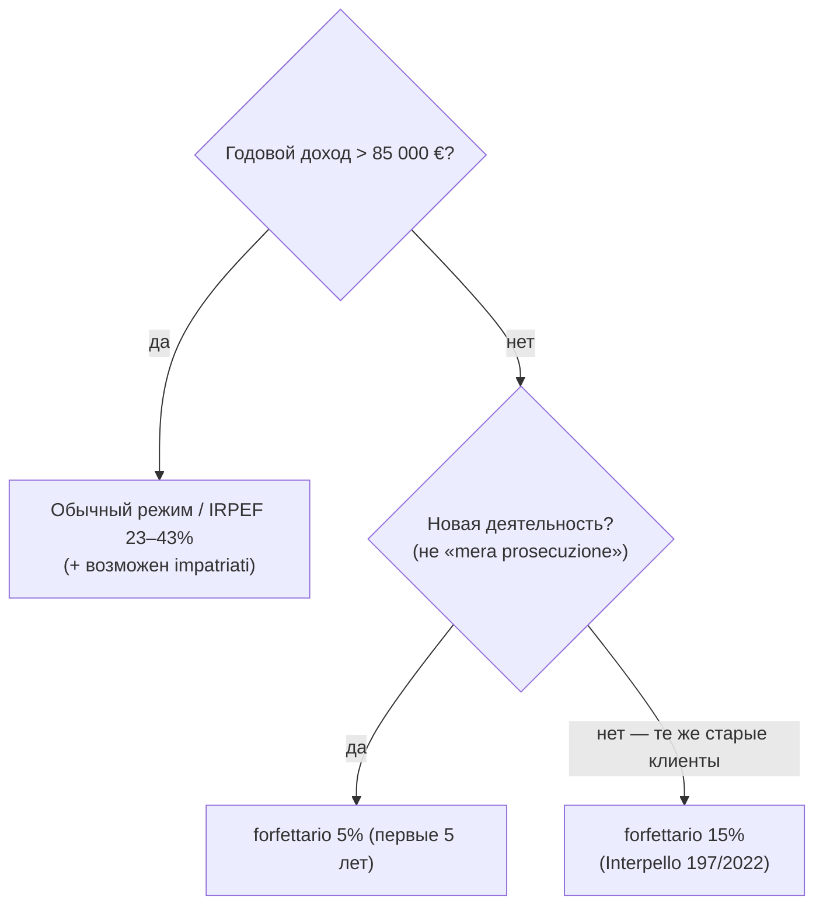

# 15. Налоги в Италии для цифровых кочевников

[← Жильё в Италии](14-housing-italy.md) | [Воссоединение семьи →](16-family-process.md)

> **Коротко:** Для ИП на forfettario: ~25-27% от налогооблагаемой базы (5% подоходный + ~26% INPS). Для forfettario нужна residenza. Forfettario и Impatriati **не совместимы**. Регистрация в INPS — в течение 30 дней после открытия ИП. **С марта 2026** — Италия тоже приостановила зачёт налогов с РФ (двусторонняя блокировка).

**Содержание:**
- [Налоговое резидентство](#налоговое-резидентство)
- [Определение налогового резидентства другими странами](#определение-налогового-резидентства-другими-странами)
- [Regime Forfettario (упрощёнка для ИП)](#regime-forfettario-упрощёнка-для-ип)
- [Расчёт forfettario по видам деятельности (ATECO)](#расчёт-forfettario-по-видам-деятельности-ateco)
- [Расчёт forfettario — нюансы](#расчёт-forfettario--нюансы)
- [Regime Impatriati (режим для новых резидентов)](#regime-impatriati-режим-для-новых-резидентов)
- [Совместимость режимов Impatriati и Forfettario](#совместимость-режимов-impatriati-и-forfettario)
- [Налоговый режим для исследователей (Ricercatori)](#налоговый-режим-для-исследователей-ricercatori)
- [Обычный режим (свыше 85 000 EUR)](#обычный-режим-свыше-85-000-eur)
- [IRPEF — базовые ставки](#irpef--базовые-ставки)
- [Налоги для наёмных сотрудников на DN визе](#налоги-для-наёмных-сотрудников-на-dn-визе)
- [Налоговый статус для наёмных работников (прибытие после июля)](#налоговый-статус-для-наёмных-работников-прибытие-после-июля)
- [Налоговые декларации для наёмных (продление ВНЖ)](#налоговые-декларации-для-наёмных-продление-внж)
- [Социальные взносы для наёмных работников (проблема)](#социальные-взносы-для-наёмных-работников-проблема)
- [Двойное налогообложение РФ–Италия](#двойное-налогообложение-рфиталия)
- [Социальное страхование (INPS) — соглашения](#социальное-страхование-inps--соглашения)
- [Штрафы и ответственность за неуплату](#штрафы-и-ответственность-за-неуплату)
- [Ведение Partita IVA после переезда](#ведение-partita-iva-после-переезда)
- [Налог на недвижимость (prima casa)](#налог-на-недвижимость-prima-casa)
- [Российская налоговая специфика](#российская-налоговая-специфика)

---
> **🤖 Обзор от AI** (ориентир; сверяйте с commercialista и Agenzia delle Entrate — ставки/пороги меняются ежегодно).
>
> 1. **Резидентство.** Вы налоговый резидент Италии, если ≥183 дней в году выполнено хотя бы одно: прописка / центр жизненных интересов (семья) / фактическое присутствие (ст. 2 TUIR, обновлена с 2024). Резидент платит с мирового дохода.
> 2. **Режим для ИП/фрилансеров.** Доход ≤ 85 000 € и новая деятельность → **forfettario 5%** (первые 5 лет); продолжение прежней деятельности с теми же клиентами («mera prosecuzione») → **15%**; доход > 85 000 € → обычный IRPEF (23–43%).
> 3. **impatriati** (освобождение 50% дохода, лимит 600 000 €/год, 5 лет) — альтернатива для наёмных и профи; **несовместим с forfettario**, требует высокой квалификации и работы преимущественно в Италии.
> 4. **Наёмные DN.** Обязательность INPS остаётся **спорной** — единой практики квестур/INPS нет (см. раздел ниже).


🟡 Никаких налогов к моменту продления ВНЖ (через год) вы скорее всего ещё не заплатите, поскольку полгода уходит на то, чтобы открыть ИП. Вместо этого обращаетесь к commercialista, и он даёт справку, что «у вас всё хорошо». Но вывод он сделает исходя из ваших доходов за неполный год — лучше успеть зарегистрировать ИП. · [ne_putai #3567](https://t.me/ne_putai/3567) · Сентябрь 2025 ·

🟡 **Общая оценка налоговой нагрузки:** Для фрилансеров на forfettario подоходный налог составляет 5% первые 5 лет, но социальные и пенсионные взносы — ~26%. Итого около **25–27%** от налогооблагаемой базы в первые годы. Для наёмных работников — подоходный по прогрессивной шкале (23–43%) + соцвзносы ~26%. Service agreement (по сути фриланс) — открывает ИП в Италии и платит налоги через него. · [emigrantista #1415](https://t.me/emigrantista_answers/1415), [emigrantista #1419](https://t.me/emigrantista_answers/1419) · Октябрь 2024 ·

## Налоговое резидентство

🟡 Налоговое резидентство Италии присваивается, если вы в течение **183 дней** соответствовали одному из условий:
1. Находились в стране физически
2. Были прописаны (residenza)
3. Имели «обычное место пребывания» (habitual abode)
4. Или «центр жизни» (domicile) — семья или другие социальные интересы
Суть: «place where, primarily, personal and family relationships of the person develop». · [ne_putai #3567](https://t.me/ne_putai/3567) · Сентябрь 2025 ·

🟡 Налоговое резидентство «включается» **сразу на весь год**. Формально начинает действовать, как только зарегистрировались по месту жительства. За кочевниками присматривают особо: миграционная служба направляет данные в налоговую. · [emigrantista #1419](https://t.me/emigrantista_answers/1419) · Октябрь 2024 ·

🟡 **Реальный кейс (2024):** Резиденца получена в июне, дети находились в РФ до августа (центр жизненных интересов). Бухгалтер пытался не фиксировать налоговое резидентство за этот год — но формально более 183 дней в стране означают резидентство. · [rutoitalychat #105161](https://t.me/rutoitalychat/105161) · Август 2025 ·

🔴 **Момент начала налогового резидентства для DN — спорный вопрос.** Консультант по налогам не дал чёткого ответа, с какого момента DN-заявитель становится налоговым резидентом: (1) с момента ВНЖ + 183 дня, (2) с момента 183 дней фактического проживания, или (3) с момента въезда по визе D. Консультант сказал «зависит от сроков получения ВНЖ», но количество фактически прожитых дней тоже должно влиять. · [rutoitalychat #88012](https://t.me/rutoitalychat/88012) · Февраль 2025 ·

🟡 **Уточнение (март 2026):** Условия определения налогового резидентства в законе объединены через **«или»** — достаточно одного из них. Долгосрочная не-туристическая аренда и оплата коммунальных услуг — уже повод считать Италию «центром жизненных интересов». ВНЖ само по себе создаёт обязательства — при получении ВНЖ нужно подать КИТ в течение 8 дней, иначе пребывание считается незаконным (ст. 5 TUI). Вывод: **DN виза без ВНЖ и налогов — технически невозможна**, если вы подали КИТ. · [nomadvisaitaly #10453-10490](https://t.me/nomadvisaitaly/10453) · Март 2026 ·

🟡 Налоги в Италии **не зависят от типа визы**. Платить нужно со **всего** дохода, не только с минимума для ВНЖ. Минимальный порог DN — 24 789 EUR, Lavoro Autonomo — 8 500 (осталось только на бумаге). Но налоги определяются реальным доходом и режимом налогообложения. · [emigrantista #1662](https://t.me/emigrantista_answers/1662) · Октябрь 2025 ·

🟡 **Техническая лазейка (не рекомендуется):** Можно получить визу D, въехать, не оформлять ВНЖ и прописку, не становиться налоговым резидентом. Но **продлить визу не получится**. Если живёте 183+ дней, получили ВНЖ, оформили резиденцию — вы налоговый резидент независимо от типа визы, платите со всех мировых доходов. · [emigrantista #1676](https://t.me/emigrantista_answers/1676) · Октябрь 2025 ·

🟡 Налоговое резидентство определяется пребыванием **>183 дней** в году в Италии. Если стал налоговым резидентом к концу года, обязан задекларировать доход и заплатить налог в Италии **даже без открытой P.IVA** — через форму **730 (Modello 730)**; срок подачи декларации за прошлый год — **до конца сентября**. Квестура не налоговый орган, но при продлении пермессо может спросить про уплату налогов. · [nomadvisaitaly #13366](https://t.me/nomadvisaitaly/13366), [nomadvisaitaly #13369](https://t.me/nomadvisaitaly/13369), [nomadvisaitaly #13372](https://t.me/nomadvisaitaly/13372) · 29 июня 2026 ·

🟡 **Зарубежные активы налогового резидента (@sokhareva):** помимо декларирования всех мировых доходов, резидент Италии обязан отчитываться о **зарубежных банковских счетах** (при среднем балансе >5 000 € или пике >15 000 €) и платить налоги **IVAFE** (на зарубежные финансовые активы) и **IVIE** (на зарубежную недвижимость). · [nomadi_digitali #82](https://t.me/nomadi_digitali/82) · Июнь 2026 ·

## Определение налогового резидентства другими странами

🟡 Даже если вы проводите менее 183 дней в стране, вас могут признать налоговым резидентом, если там живёт ваша **семья** (супруга/супруг). Известен случай: финские власти обложили человека налогом, хотя он жил в Финляндии менее 183 дней — «у тебя здесь жена обучается, значит центр жизненных интересов в Финляндии». · [nomadvisaitaly #2367](https://t.me/nomadvisaitaly/2367) · Июнь 2024 ·

## Regime Forfettario (упрощёнка для ИП)



Наиболее выгодный налоговый режим для большинства цифровых кочевников-самозанятых.

### Условия применения

🟢 Лимит годового дохода: **85 000 EUR**. При превышении — переход на обычный режим в следующем году. При превышении 100 000 EUR — немедленный переход. Расходы на сотрудников: не более **20 000 EUR** в год. Доходы от наёмной работы (если есть): не более **35 000 EUR**. · [expath.it — Forfettario 2025](https://www.expath.it/requirements-to-maintain-regime-forfettario-in-2025-an-easy-guide-for-expats/) · 2025 ·

🟡 Для перехода на forfettario **нужна прописка** (residenza). Без неё — обычный режим с высокими налогами. · [ne_putai #3567](https://t.me/ne_putai/3567) · Сентябрь 2025 ·

🟡 **Когда forfettario становится доступен — зависит от даты въезда.** Если въехали до июля — вы резидент за весь год, forfettario возможен сразу. Если въехали после июля — вы нерезидент за этот год, нужно открывать Regime Ordinario (обычный), а с 1 января следующего года переходить на forfettario. На практике большинство открывает forfettario сразу. · [immigrazia_IT #6798](https://t.me/immigrazia_IT/6798) · Апрель 2026 ·

🟡 Открыть forfettario **до получения Anagrafe** (прописки) гражданину не из ЕС — на практике много успешных кейсов, если уже фактически живёшь в Италии и здесь центр жизненных интересов. · [nomadvisaitaly #13218](https://t.me/nomadvisaitaly/13218), [nomadvisaitaly #13219](https://t.me/nomadvisaitaly/13219) · 25 июня 2026 ·

### Расчёт налогов

🟡 На упрощёнке нельзя делать никаких вычетов. От дохода (гросс) берётся **коэффициент рентабельности** по виду деятельности. Для программистов-фрилансеров (код ATECO 62.01.00): **67%**. Это считается налогооблагаемым доходом (33% — это то, что налоговая позволяет «вычесть»). · [ne_putai #3568](https://t.me/ne_putai/3568) · Сентябрь 2025 ·

🟢 Налоговая ставка: **5%** первые 5 лет (при соответствии условиям стартапа), **15%** далее. · [expath.it](https://www.expath.it/requirements-to-maintain-regime-forfettario-in-2025-an-easy-guide-for-expats/) · 2025 ·

🟡 Страховые взносы INPS: **~26,07%** от налогооблагаемой базы (gestione separata INPS). Налог и соцстрах начисляются **независимо** друг от друга. Помимо годовой суммы, INPS требует уплаты **аванса** (~50% от суммы прошлого года), что увеличивает нагрузку в первый год уплаты. · [ne_putai #3568](https://t.me/ne_putai/3568), [nomadvisaitaly #4505](https://t.me/nomadvisaitaly/4505), [immigrazia_IT #2134](https://t.me/immigrazia_IT/2134) · 2024–2025 ·

🟡 **В первый год INPS НЕ вычитается из налогооблагаемой базы** — и INPS, и подоходный считаются с полной базы. Вычет INPS из базы начинается **со второго года**. Это частая ошибка при самостоятельном расчёте. · [nomadvisaitaly #11758](https://t.me/nomadvisaitaly/11758), [nomadvisaitaly #11786](https://t.me/nomadvisaitaly/11786) · Май 2026 ·

🟡 **Авансовые платежи (acconto):** первый расчётный год вы платите фактически **за два года** — налог за прошедший год + предоплату (acconto) за следующий; в следующем году предоплата вычитается. Acconto разбивается **50/50** и его можно платить в рассрочку (6–7 рат), но остаточный платёж по 2-му acconto до **30 ноября** вносится одним платежом — поэтому декабрь получается «дорогим». · [nomadvisaitaly #11930](https://t.me/nomadvisaitaly/11930), [nomadvisaitaly #11932](https://t.me/nomadvisaitaly/11932) · Май 2026 ·

🟡 **Декларацию за прошлый год нельзя сделать раньше мая:** налоговая каждый год в мае рассылает коммерчиалистам обновлённый софт для формирования и отправки деклараций. До этого возможен только предварительный расчёт «по образцу», нигде не зарегистрированный. · [nomadvisaitaly #11752](https://t.me/nomadvisaitaly/11752) · Май 2026 ·

### Пример расчёта для программиста

```
Годовой доход (гросс):         €50 000
Коэффициент рентабельности:     × 67% = €33 500 (налогооблагаемая база)

Страховые взносы (INPS):        €33 500 × 26% = €8 710
Налог на доходы:                €33 500 × 5%  = €1 675  (первые 5 лет)
                          или   €33 500 × 15% = €5 025  (после 5 лет)

Итого налогов (первые 5 лет):   €10 385 = ~20,9% от дохода
Итого налогов (после 5 лет):    €13 735 = ~27,5% от дохода
```

🟡 Итого получаются «в меру приятные» **20,9%** на всё. Подтверждается [калькулятором fidocommercialista](https://fidocommercialista.it/calcolatore). · [ne_putai #3568](https://t.me/ne_putai/3568) · Сентябрь 2025 ·

🟡 **Ориентир:** при доходе примерно до **85 000 €** обычно можно уложиться в эффективную ставку около **21%**. · [nomadvisaitaly #13488](https://t.me/nomadvisaitaly/13488) · 2 июля 2026 ·

### Пример расчёта при минимальном доходе для DN (программист)

```
Годовой доход (гросс):         €28 000
Коэффициент рентабельности:     × 67% = €18 760 (налогооблагаемая база)

НДФЛ 5% (первые 5 лет):        €18 760 × 5%    = €938
INPS 26,3%:                     €18 760 × 26,3% = €4 934
Аванс INPS (~50%):              €4 934 × 50%    = €2 467

Итого первый год:               €938 + €4 934 + €2 467 = ~€8 339
На руки:                        ~€19 661/год (~€1 639/мес)
```

🟡 Для продления ВНЖ как фрилансеру достаточно показать доход ~9 400 EUR в декларации. · [immigrazia_IT #2134](https://t.me/immigrazia_IT/2134) · Апрель 2024 ·

🟡 **Ориентир «минималки» для продления (2026):** по практике коммерчиалиста для уверенного продления ВНЖ DN стоит показывать доход около **25 000 EUR/год** — налоги платятся с этой суммы. Если ИП открыто в конце года, сумма декларации (и налогов) за первый год может быть меньше — зависит от конкретной ситуации. · [nomadvisaitaly #11780](https://t.me/nomadvisaitaly/11780), [nomadvisaitaly #11914](https://t.me/nomadvisaitaly/11914) · Май 2026 ·

### Пенсия

🟡 Если не планируете оставаться до ПМЖ — пенсию можно **забрать наличными** и увезти без налогов. Примерно 2/3 соцвзносов идёт на пенсию, 1/3 на медицину. В итоге, если забрать пенсию, фактически отдали ~9% от дохода. · [ne_putai #3568](https://t.me/ne_putai/3568) · Сентябрь 2025 ·

### Forfettario 5% — ограничения

🟡 Резиденты стран пост-СНГ могут **не получить** льготную ставку forfettario 5% (условие — не быть налоговым резидентом Италии или стран с соглашением об обмене данными в предыдущие 3 года). · [nomadvisaitaly #1583](https://t.me/nomadvisaitaly/1583) · 2024 ·

### Commercialista (бухгалтер)

🟡 Стоимость услуг commercialista: **~400 EUR/год** + ~80 EUR за открытие ИП. · [nomadvisaitaly #2611](https://t.me/nomadvisaitaly/2611) · 2024 ·

🟡 Очень сложно найти компетентного commercialista (налогового консультанта), который понимает особенности налогообложения для номадов с доходом из РФ. Рекомендуется дождаться получения ВНЖ и найти специалиста через знакомых итальянцев на месте, чем доверять дистанционным консультантам. · [nomadvisaitaly #1444](https://t.me/nomadvisaitaly/1444) · Ноябрь 2025 ·

## Расчёт forfettario по видам деятельности (ATECO)

🟡 **Подробные расчёты налогов по ATECO кодам (март 2026):** Наталья Сохарева составила расчёты для типичных профессий DN. Ключевой параметр — **коэффициент рентабельности**, который зависит от кода ATECO вида деятельности. Для IT (62.01.00) — 67%, для консалтинга — 78%, для дизайна — 67%, для коучинга — 78%. Расчёты опубликованы в чате и содержат примеры для разных профессий и уровней дохода. · [nomadvisaitaly #10701](https://t.me/nomadvisaitaly/10701) · Март 2026 ·

🟡 **Детальная разбивка от того же консультанта (Наталья Сохарева, @sokhareva) в её канале:** коэффициент налогооблагаемой базы (НОБ) в forfettario зависит от кода ATECO. **IT-разработка (62.0x) — 67%** (выгоднее всего). **78%** — маркетинг/реклама, креатив/дизайн/SMM, консалтинг/коучинг, блогеры. Пример при доходе 30 000 €: IT даёт НОБ 20 100 € → INPS (gestione separata ~26,07%) ≈ 5 240 € + налог 5% ≈ 743 € → всего ~5 983 €/год. · [nomadi_digitali #46](https://t.me/nomadi_digitali/46) · Март 2026 ·

🔴 **Спорно — коэффициент для дизайна:** в кратком перечне выше (#10701) дизайн отнесён к 67%, а в детальной разбивке (#46) креатив/дизайн/SMM — к 78%. Коэффициент привязан к конкретному коду ATECO, поэтому свой код стоит уточнить у коммерчиалиста. · [nomadvisaitaly #10701](https://t.me/nomadvisaitaly/10701), [nomadi_digitali #46](https://t.me/nomadi_digitali/46) · Март 2026 ·

## Расчёт forfettario — нюансы

🟡 На упрощёнке нельзя делать никаких вычетов. От дохода берётся **коэффициент прибыльности** по виду деятельности. Для программистов-фрилансеров: **67%** (33% налоговая позволяет «вычесть» как расходы). Но это для ATECO 62.01.00. Другие виды деятельности могут иметь другие коэффициенты. · [nomadvisaitaly #5677](https://t.me/nomadvisaitaly/5677) · Апрель 2025 ·

### Forfettario — сниженная ставка 5% и новая деятельность

🟡 Режим Forfettario предусматривает налог в размере 15% на валовый доход с коэффициентом в зависимости от ATECO кода. Сниженная ставка 5% применяется только для НОВОЙ деятельности (впервые ведущейся, а не расширение предыдущей деятельности). Даже если деятельность велась вне Италии, это не считается новой. 5% действует 5 первых налоговых периодов. Возможна аудит налоговой через 5 лет с донасчислением пени. · [nomadvisaitaly #1380, #1384](https://t.me/nomadvisaitaly/1380) · Ноябрь 2025 ·

🔴 **5% под вопросом при «переезде» бизнеса из-за рубежа (июнь 2026):** официальное разъяснение Agenzia delle Entrate — **Interpello 197/2022**: если после переезда продолжаешь оказывать те же услуги тем же старым клиентам, это **«mera prosecuzione»** (продолжение прежней деятельности), а не новый стартап → право только на **15%**. Дополнительно правило 3 лет (L. 190/2014, art. 1, comma 65, lett. a): требуется полное отсутствие предпринимательской деятельности в течение **3 лет** до открытия P.IVA, причём **без оговорки** «только на территории Италии». Риск при аудите (часты через 3–4 года) — доначисление разницы + штраф **90–120%**. [Текст разъяснения (PDF)](https://www.agenziaentrate.gov.it/portale/documents/20143/4335071/Risposta_197_20.04.2022.pdf) · [nomadvisaitaly #13377](https://t.me/nomadvisaitaly/13377), [nomadvisaitaly #13387](https://t.me/nomadvisaitaly/13387), [nomadvisaitaly #13391](https://t.me/nomadvisaitaly/13391) · 29 июня 2026 ·

🟡 **Контр-мнение практикующего консультанта:** формально «мы ничего не перевозили, а открыли новое итальянское ИП» часто срабатывает — налоговой сложно доказать длящиеся контракты и совпадение кодов деятельности; достаточно после переезда переписать контракты заново. Народ переезжал по LA со своим ИП/ООО ещё с 2016 года без массовых доначислений. При опасениях — альтернатива **Regime impatriati** (скидка до 50% на налог, можно учитывать расходы). · [nomadvisaitaly #13388](https://t.me/nomadvisaitaly/13388), [nomadvisaitaly #13394](https://t.me/nomadvisaitaly/13394) · 29 июня 2026 ·

### Forfettario + доход от найма

🟡 Чтобы оставаться на режиме Forfettario со своей Partita IVA, доход от найма (в том числе зарубежного) не может превышать **30 000–35 000 EUR** в год (см. условия применения выше). Это дополнительное ограничение помимо лимита в 85 000 EUR по ИП. Актуально для тех, кто параллельно работает в найме в РФ и имеет итальянскую Partita IVA. · [rutoitalychat #80584](https://t.me/rutoitalychat/80584) · Декабрь 2024 ·

### Риск «ложной партиты» (false partita IVA)

🟢 В Италии налоговая может **переквалифицировать** отношения с единственным заказчиком из фриланса в «lavoro subordinato» (наёмный труд) со штрафами. Критерии проверки: единственный клиент, фиксированный график, работа на территории заказчика. В законе есть исключения, но каждый случай оценивается индивидуально. · [rutoitalychat #52183](https://t.me/rutoitalychat/52183) · Май 2024 ·

## Regime Impatriati (режим для новых резидентов)

Специальный режим для высококвалифицированных специалистов, переехавших в Италию.

🟡 Позволяет уменьшить налогооблагаемую базу IRPEF **в 2 раза** (облагается только 50% дохода — или 40% при наличии несовершеннолетних детей). Но это куча возни: нужно подтвердить, что не был резидентом Италии **последние 3 года**, а следующие **4 года** обещаете жить и работать в стране. · [ne_putai #3569](https://t.me/ne_putai/3569) · Сентябрь 2025 ·

🟢 Подробности на [сайте Agenzia delle Entrate](https://www.agenziaentrate.gov.it/portale/lavoratori-impatriati-209-2023/infogen-lavoratori-impatriati-209-2023-cittadini). · [Agenzia delle Entrate](https://www.agenziaentrate.gov.it/) · 2023 ·

🟡 Режим Impatriati подходит для номад виз. Запрашивается при первой подаче налоговой декларации. Одобрение зависит от правильности запроса, полноты документации. Рекомендуется работать с commercialista (налоговым консультантом), который специализируется на этом режиме. · [nomadvisaitaly #1164](https://t.me/nomadvisaitaly/1164) · Июнь 2025 ·

🟡 Лимит дохода для impatriati: до **600 000 EUR**. Нужен диплом бакалавра, подтверждённый в консульстве. · [nomadvisaitaly #441](https://t.me/nomadvisaitaly/441), [nomadvisaitaly #542](https://t.me/nomadvisaitaly/542) · 2024 ·

🟢 Режимы forfettario и impatriati **не совместимы**. Forfettario — упрощённый режим с фиксированным коэффициентом рентабельности и ставкой 5/15%. Impatriati — льгота по IRPEF (сокращение налогооблагаемой базы на 50%). Они применяются к разным налоговым режимам и не комбинируются. · Обсуждения в чате, уточнение апрель 2026 · 2024–2026 ·

### Калькуляторы

- [Калькулятор impatriati — moving2italy.com](https://moving2italy.com/it/calcolo-tassazione-rientro-dei-cervelli/wizard)
- [Калькулятор forfettario — fidocommercialista.it](https://fidocommercialista.it/calcolatore)
- [Таблица forfettario (Google Sheets)](https://docs.google.com/spreadsheets/d/1CA_69OrLyrRNB95XHt-3YAvJmkJgI3li7ITL-qFvW78/)

## Совместимость режимов Impatriati и Forfettario

🔴 Вопрос совместимости режимов Impatriati и Forfettario остаётся **спорным**. По решению суда от декабря 2024 года режимы могут быть совместимы с ограничениями: в разные налоговые годы можно использовать оба режима, в один год для разных источников дохода допустимо применение обоих режимов. Однако для фрилансеров-кочевников (nomadi digitali) это неприменимо. Для номадов на найме в иностранной компании режим Impatriati может применяться при подаче налоговой декларации в Италии. Требуется уточнение с commercialista. · [nomadvisaitaly #1164](https://t.me/nomadvisaitaly/1164) · Июнь 2025 ·

## Налоговый режим для исследователей (Ricercatori)

🟡 У новоприбывших **исследователей** (ricercatori) есть налоговый режим, который уменьшает облагаемый доход на **90%** на срок от 6 до 13 лет. Получается эффективная ставка ~4% + страховые взносы. Лимит дохода сверху — без ограничений. По выгодности превосходит forfettario. · [nomadvisaitaly #9385](https://t.me/nomadvisaitaly/9385) · Февраль 2026 ·

## Обычный режим (свыше 85 000 EUR)

🟡 Если по доходам превышаете **85 000 EUR гросс**, то на обычном режиме налоги **более 50%**. Режим impatriati позволяет уменьшить примерно на 10%. Значительная часть — пенсия (которую можно забрать). · [ne_putai #3569](https://t.me/ne_putai/3569) · Сентябрь 2025 ·

🟢 IRPEF — прогрессивный подоходный налог: 23% до 28 000 EUR, 35% от 28 000 до 50 000 EUR, 43% свыше 50 000 EUR. Плюс социальные взносы INPS. · [Общеизвестно, итальянское налоговое законодательство] · 2025 ·

## IRPEF — базовые ставки

🟡 Базовая система налогообложения в Италии (IRPEF):
— до **28 000 EUR** — 23%
— от 28 000 до **50 000 EUR** — 35%
— от **50 000 EUR** — 43%
· [nomadvisaitaly #2323](https://t.me/nomadvisaitaly/2323) · Июнь 2024 ·

## Налоги для наёмных сотрудников на DN визе

🔴 Не понятно, как должен платить налоги номад — наёмный сотрудник. По данным из чата, это «в общем-то, вообще никому не понятно». · [ne_putai #3571](https://t.me/ne_putai/3571) · Сентябрь 2025 ·

### Важное разъяснение от итальянского коммерчиалиста (февраль 2026)

🟡 **При договоре найма с работодателем:**
- **Нельзя открывать Partita IVA** с договором найма
- Платить соц.взносы может только **представительство компании-работодателя в Италии** за вас
- Вы сами **не можете** платить соц.взносы
- Платите **только IRPEF** (итальянский НДФЛ)
- **Эту декларацию** IRPEF несёте на продление ВНЖ

Если хотите открыть Partita IVA — нужно **переделывать договор с работодателем** как с ИП (service agreement вместо employment contract).

· [nomadvisaitaly #9410](https://t.me/nomadvisaitaly/9410) · Февраль 2026 ·

### Продление ВНЖ для наемных

🟡 **Консультация у Юлии (@emigrantista)** (февраль 2026):

Если вы заезжаете как **наемный работник**:
- **Не можете** платить соц.взносы самостоятельно
- Нужно купить **страховку за ~2 000 EUR на человека** и приложить её к продлению (вместо соц.взносов)
- Номад как раз для тех работников, работодатели которых **не могут платить налоги в ЕС**

**Но:** У Юлии ещё **нет кейсов продления** по этой схеме (на февраль 2026).

· [nomadvisaitaly #9307](https://t.me/nomadvisaitaly/9307) · Февраль 2026 ·

### Другие варианты для наёмных

🟡 С forfettario нельзя продолжать работу с тем же работодателем, с которым был трудовой договор. · [nomadvisaitaly #534](https://t.me/nomadvisaitaly/534) · 2024 ·

🟡 При применении режима Forfettario нельзя продолжать работать с тем же работодателем (заказчиком). Это значительное ограничение для фрилансеров и номадов. · [nomadvisaitaly #46](https://t.me/nomadvisaitaly/46) · Апрель 2024 ·

🟡 Для найма возможны **4 варианта** налогообложения:
1. **Самый невыгодный**: двойные налоги и взносы — номад создаёт ИП в Италии, платит подоходный и взносы. Работодатель тоже платит.
2. **Самый простой**: двойные взносы, одинарный налог — номад создаёт ИП, работодатель не платит подоходный (человек сам платит через ИП).
3. С использованием соглашений об избежании двойного налогообложения (если таковые действуют).
4. Через итальянское представительство работодателя (если есть).
· [nomadvisaitaly #4131](https://t.me/nomadvisaitaly/4131) · Ноябрь 2024 ·

🟡 Платить и в РФ, и в Италии в итоге придётся. В Италии оптимизировать можно **только через Forfettario** — других вариантов особо нет. · [nomadvisaitaly #7500](https://t.me/nomadvisaitaly/7500) · Октябрь 2025 ·

🟢 По закону (постановление о визе DN) удалённый работник на территории Италии **обязан платить страховые взносы**. Если нет налогового агента (представительства работодателя в Италии), единственный способ платить INPS — через **Partita IVA**. Без ИП или налогового агента уплата страховых невозможна. · [rutoitalychat #89464](https://t.me/rutoitalychat/89464), [rutoitalychat #89469](https://t.me/rutoitalychat/89469) · Февраль 2025 ·

🔴 **Устные заверения INPS — осторожно (май 2026):** наёмный DN сходил в **INPS Турина (Коленьо)** с армянским трудовым договором — там сказали, что он **ничего им не должен платить** (без бумаги, только устно; 2 часа обзванивали коллег, он у них первый такой). Andrei (консультант) предупреждает: устным заверениям чиновников доверять рискованно; при открытии P.IVA INPS идёт «комплектом», а DN в найме P.IVA не открывает. Главный риск — что эту схему потом не примет квестура на продлении. · [nomadvisaitaly #11654](https://t.me/nomadvisaitaly/11654), [nomadvisaitaly #11687](https://t.me/nomadvisaitaly/11687) · Май 2026 ·

🟡 **На продлении могут обязать открыть ИП (Милан):** известен кейс — на первое ВНЖ квестура Милана приняла контракт + декларации из РФ, а на продление **потребовала показать открытое ИП**. · [nomadvisaitaly #11685](https://t.me/nomadvisaitaly/11685), [nomadvisaitaly #11688](https://t.me/nomadvisaitaly/11688) · Май 2026 ·

## Налоговый статус для наёмных работников (прибытие после июля)

🟡 Наёмные работники, прибывшие в Италию **после июля**, будут платить налоги в следующем году только, так как в текущем году они ещё не станут налоговыми резидентами (не наберут 183 дня). Это даёт отсрочку на уплату налогов в первый год после переезда. Но при этом деятельность стоит начать как можно раньше, чтобы за первый год показать в декларации достаточный доход для продления ВНЖ. · [nomadvisaitaly #1453](https://t.me/nomadvisaitaly/1453), [rutoitalychat #3366](https://t.me/rutoitalychat/3366) · 2023–2025 ·

## Налоговые декларации для наёмных (продление ВНЖ)

🟡 Для продления ВНЖ наёмные работники должны предоставить налоговые выписки из страны, где они зарегистрированы как сотрудники. Необходимо показать сумму уплаченного налога в стране трудоустройства и подать итальянскую декларацию для зачета налогов. Живые кейсы этого процесса ещё не закрыты полностью (некоторые остаются первопроходцами). · [nomadvisaitaly #1453](https://t.me/nomadvisaitaly/1453) · Ноябрь 2025 ·

## Социальные взносы для наёмных работников (проблема)

🔴 Для наёмных работников с визой Digital Nomad существует проблема с социальными взносами. Если использовать зачет двойного налогообложения (система франшизы), социальные взносы могут не засчитываться, что негативно влияет на право на будущую пенсию. Одно из решений — открыть ИП в Италии и декларировать доход из РФ через него, но механизм всё ещё плохо изучен и нет четких инструкций. Вопрос о зачете социальных взносов, уплаченных в РФ, для итальянского номада остаётся открытым даже для людей, живущих в стране 2–3 года. · [nomadvisaitaly #1444](https://t.me/nomadvisaitaly/1444) · Ноябрь 2025 ·

🔴 **Обширная дискуссия об INPS для наёмных DN (март 2026):** Вопрос обязательности INPS для наёмных DN остаётся спорным. **Позиция 1** (коммерчиалист Натали): наёмный удалёнщик платит **только IRPEF**, страховые не платит, ИП открывать не обязан. **Позиция 2** (Kseniia и её коммерчиалист): работа на территории Италии = обязанность платить INPS (закон №190/2014). Без INPS — нарушение закона. Единственный рабочий вариант на данный момент — через Partita IVA. **Факт:** кейсов успешного продления ВНЖ **без уплаты INPS** пока нет. Первые декларации с доходами DN будут только в мае 2026 — после этого станет яснее. · [nomadvisaitaly #10341-10403](https://t.me/nomadvisaitaly/10341) · Март 2026 ·

🟡 **Запрос в INCA по налогам для наёмных DN (март 2026):** Организация [INCA](https://inca.it/) (патронато, финансируемый государством) подтвердила: единой практики взаимодействия между квестурой и ИНПС по DN нет. Предложили разбираться по конкретному кейсу с официальными органами. INCA может оказать помощь в любом регионе Италии. · [nomadvisaitaly #10432](https://t.me/nomadvisaitaly/10432) · Март 2026 ·

🟡 **Практика (апрель 2026):** Первые номады подходят к продлению ВНЖ. Кто-то открыл Partita IVA, но контрактов ещё нет. Квестуре важен понятный доход и оплаченные налоги — конкретный сценарий (фриланс vs найм vs микс) вторичен. Первые декларации с доходами DN будут подаваться в мае-июне 2026 — после этого появится реальная практика. · [rutoitalychat #123284](https://t.me/rutoitalychat/123284) · Апрель 2026 ·

## Двойное налогообложение РФ–Италия

🟢 С **2023 года** Россия отменила все статьи соглашения о двойном налогообложении с Италией. НДФЛ уплаченный в России **не зачитывается** в Италии. Источники: Consultant.ru document LAW_454278, Минфин РФ информация о статусе договоров. · [Consultant.ru — Указ Президента](https://www.consultant.ru/document/cons_doc_LAW_454278/#dst100050), [Минфин РФ](https://minfin.gov.ru/ru/document?id_4=307315) · 2023–2025 ·

🟢 **С марта 2026 Италия также приостановила** действие ряда статей налоговой конвенции с Россией со своей стороны. Ранее приостановка была только односторонней (со стороны РФ), теперь — двусторонняя. Зачёт налогов между РФ и Италией **полностью заблокирован с обеих сторон**. · [Gazzetta Ufficiale 24.03.2026](https://www.gazzettaufficiale.it/eli/id/2026/03/24/26A01457/sg), [nomadvisaitaly #11221](https://t.me/nomadvisaitaly/11221) · Март 2026 ·

🟡 **Независимое подтверждение + прогноз ужесточения (канал immigrazia_IT).** Приостановку СИДН (подписанной 9 апреля 1996) подтверждает и консультант. Важный нюанс: раньше держателей ВНЖ по выбранному месту жительства (residenza elettiva), плативших налоги с пассивных доходов на родине, итальянская налоговая фактически не трогала; теперь, на фоне ужесточения фискальной политики, это может измениться — консультант прогнозирует, что в **2027** налоговая может вспомнить и про таких резидентов (обмен данными с квестурами налажен). Касается граждан РФ с ВНЖ Италии, включая налоговых резидентов на DN. · [immigrazia_IT #6883](https://t.me/immigrazia_IT/6883) · Апрель 2026 ·

🟡 При переезде в Италию с работой в РФ/Грузии/Армении придётся платить налоги и в стране-источнике дохода и в Италии. Может помочь режим Forfettario в Италии. Зачесть налоги из РФ часто не получается из-за отмены соглашения. С Грузией/Арменией можно пробовать зачет налогов. · [nomadvisaitaly #1361](https://t.me/nomadvisaitaly/1361) · Октябрь 2025 ·

🟡 **Типичный сценарий для DN в найме в РФ:** работодатель удерживает 13–15% НДФЛ в РФ. При переезде в Италию дополнительно нужно задекларировать и заплатить IRPEF (23–43%). Зачесть российский НДФЛ **нельзя** — соглашение приостановлено. Российский работодатель не может напрямую платить в Италию. Итого двойная нагрузка. · [rutoitalychat #110203](https://t.me/rutoitalychat/110203), [rutoitalychat #112120](https://t.me/rutoitalychat/112120) · Сентябрь–Октябрь 2025 ·

🟡 **Для DN в найме в РФ минимальный доход выше**: при подаче на визу для наёмных сотрудников нужно показать доход по «среднему для специалистов в Италии» — порядка **33 500 EUR/год** (а не стандартные 25–28 тысяч для ИП). С двойным налогообложением — нагрузка может быть значительной. · [nomadvisaitaly #11216](https://t.me/nomadvisaitaly/11216) · Апрель 2026 ·

🟡 **Схема B2B для DN в найме в РФ (апрель 2026):** Два способа избежать двойного налогообложения:
1. **ГПХ** — переделать трудовой контракт на договор ГПХ (переходный вариант, не решает проблему полностью)
2. **B2B** — контракт между ООО в России и P.IVA в Италии. Работодатель экономит ~30% взносов + НДФЛ. Эффективная ставка в Италии на forfettario **~21–23%**. Нужно готовить до переезда, не после.
Пример: при зарплате 240 000 руб./мес работодатель платит 312 000. При B2B платит 280 000 — экономия ~384 000 руб./год. Сотрудник тоже выигрывает: 215 600 вместо 208 800 чистыми. · [immigrazia_IT #6862](https://t.me/immigrazia_IT/6862), [nomadvisaitaly #11195](https://t.me/nomadvisaitaly/11195) · Апрель 2026 ·

🟡 Во Франции налоги, уплаченные в РФ, засчитываются (по крайней мере для виз visiteur в Ницце). В Испании и Италии налоги не зачитываются. РФ односторонне приостановила некоторые пункты налоговых соглашений, так что налоги, уплаченные в Европе, не засчитываются в РФ. · [nomadvisaitaly #1443](https://t.me/nomadvisaitaly/1443) · Ноябрь 2025 ·

🟢 Если нет двусторонних соглашений о социальном страховании с Россией, применяется **итальянская** система взносов (INPS). · [integrazionemigranti.gov.it](https://integrazionemigranti.gov.it/it-it/Ricerca-news/Dettaglio-news/id/3736/Nomadi-digitali-e-lavoratori-da-remoto-ecco-le-regole) · Апрель 2024 ·

## Социальное страхование (INPS) — соглашения

🟢 Ограничений по стране работодателя и количеству контрактов нет. Между странами нет обмена социальным страхованием, но это не создает особые проблемы для номадов. · [nomadvisaitaly #1450](https://t.me/nomadvisaitaly/1450) · Ноябрь 2025 ·

🟢 Список стран, с которыми у Италии есть соглашения о взаимном зачете социального страха: Аргентина, БиГ, Бразилия, Канада, Хорватия, Джерси, Македония, Монако, Кабо-Верде, Сан-Марино, Словения, Сербия и Черногория, США, Уругвай, Венесуэла, Австралия, Святой Престол, Швейцария, Тунис, Израиль и Ливия. **России в списке нет**. · [nomadvisaitaly #63](https://t.me/nomadvisaitaly/63) · Апрель 2024 ·

## Штрафы и ответственность за неуплату

🟡 Италия может знать о вас 3 вещи:
1. Доходы, которые вы демонстрировали для получения визы
2. Счета в странах, где есть **обмен информацией**
3. Ваши **расходы в Италии**

Если налоговая решит, что вы должны были подавать декларацию, но не подали, штраф: **от 90% до 240%** неуплаченных налогов. Если суммы выше **50 000 EUR** — тюремное заключение. Срок давности — **5 лет**. Доход из-за рубежа декларируется обязательно. · [nomadvisaitaly #6446](https://t.me/nomadvisaitaly/6446) · Июнь 2025 ·

🟡 **Расширенная информация о контроле доходов** (февраль 2026): Италия отслеживает доходы резидентов через три канала: демонстрированные доходы при получении визы, счета в странах с соглашениями об обмене информацией, расходы в Италии. При неподаче деклараций штраф: **90–240%** от неуплаченных налогов. Доход свыше **€50 000** грозит тюремным заключением. Срок давности налоговых преступлений: **5 лет**. Иностранный доход декларируется раз в год весной, налоги платятся по шкале 23–43%. При режиме Impatriati доход облагается налогом вдвое ниже. · [nomadvisaitaly #1164](https://t.me/nomadvisaitaly/1164) · Июнь 2025 ·

🟡 Реальный случай: пришло письмо из налоговой со штрафом по неуплаченным налогам. Вопрос к commercialista: «почему?». Ответ: «а, ну, я забыла». Совет: **контролируйте своего бухгалтера**. · [nomadvisaitaly #7951](https://t.me/nomadvisaitaly/7951) · Ноябрь 2025 ·

🟡 Неуплата социальных взносов и налогов может привести к проблемам с Шенгеном в будущем. Это документировано в практике. · [nomadvisaitaly #1627](https://t.me/nomadvisaitaly/1627) · Январь 2026 ·

🟡 Для решения любого вопроса с муниципалитетом/налоговой/больницей нужен **итальянский язык** или наёмный помощник с итальянским. Так во всех городах, даже крупных. · [nomadvisaitaly #3220](https://t.me/nomadvisaitaly/3220) · Август 2024 ·

## Ведение Partita IVA после переезда

Административно-операционная сторона Partita IVA после переезда: цифровой адрес для уведомлений, электронные фактуры, сроки платежей и проверки. Источник — канал консультанта @sokhareva (nomadi_digitali).

🟡 PEC (сертифицированная электронная почта) нужно назначить как **domicilio digitale** в реестре **INI-PEC** ([inipec.gov.it](https://www.inipec.gov.it)) — это официальный юридический адрес Partita IVA. Уведомления налоговой, INPS и Comune приходят в PEC и считаются **доставленными в момент прихода** (риск пропустить сроки, если не проверять почту). · [nomadi_digitali #7](https://t.me/nomadi_digitali/7) · Январь 2026 ·

🟡 **Электронные фактуры (fattura elettronica) обязательны для всех владельцев Partita IVA с 2024 года** (decreto-legge 36/2022, art. 18-3). Хранить их нужно через **conservazione elettronica a norma** (10 лет) — бесплатно активируется в личном кабинете Agenzia delle Entrate. Выставлять фактуры тоже можно бесплатно в ЛК налоговой, не платя за сторонние сервисы. · [nomadi_digitali #8](https://t.me/nomadi_digitali/8), [nomadi_digitali #48](https://t.me/nomadi_digitali/48) · 2026 ·

🟡 **Marca da bollo (гербовый сбор)** на э-фактуры без НДС (forfettario) — **2 евро** за документ при сумме фактуры **>77,47 евро**. Оплата поквартально в ЛК налоговой; при просрочке система сама применяет **ravvedimento operoso** (минимальные пени). · [nomadi_digitali #10](https://t.me/nomadi_digitali/10) · Январь 2026 ·

🟡 **График оплаты налогов Partita IVA:** 1-й платёж до **30 июня** (доплата за прошлый год + ~40% аванса за текущий), 2-й до **30 ноября** (~60% аванса). В **первый** расчётный год платят дважды: за прошлый год + предоплата (**100% налога + 80% взносов INPS**) — суммы «кусаются». Коды в F24: **1790** — аванс, **1792** — доплата за прошлый год. Можно разбить на rate (рассрочку). В **2026** срок 1-го платежа продлён до **20 июля** (Decreto-legge 89/2026, art. 6). · [nomadi_digitali #63](https://t.me/nomadi_digitali/63), [nomadi_digitali #70](https://t.me/nomadi_digitali/70), [nomadi_digitali #84](https://t.me/nomadi_digitali/84) · 2026 ·

🟡 **Когда придут первые налоги:** при открытии Partita IVA в январе 2026 первые налоги платятся только в **июне 2027** (примерно через 1,5 года), сразу с предоплатой. Бюджет стоит планировать заранее (калькулятор [nomadi-digitali.ru/nalogi](https://nomadi-digitali.ru/nalogi/)). · [nomadi_digitali #68](https://t.me/nomadi_digitali/68), [nomadi_digitali #75](https://t.me/nomadi_digitali/75) · Апрель–май 2026 ·

🟡 **Автоматические проверки деклараций налоговой часты** — доначисления приходят и через 2 года. Частая причина — **ошибка коммерчиалиста в F24** (неверный год anno di riferimento или код tributo): деньги «висят» на балансе, а система шлёт штраф. Проверять оплаты в разделе **«Cassetto fiscale → Versamenti»** личного кабинета налоговой; штраф можно оспорить (лично / онлайн / через коммерчиалиста). Задолженности — [agenziaentrateriscossione.gov.it](https://servizi.agenziaentrateriscossione.gov.it). · [nomadi_digitali #29](https://t.me/nomadi_digitali/29), [nomadi_digitali #67](https://t.me/nomadi_digitali/67), [nomadi_digitali #71](https://t.me/nomadi_digitali/71) · 2026 ·

🟡 **P.IVA, открытая ДО переезда** и не ведущая деятельность, всё равно требует **ежегодных нулевых деклараций** за все годы. Последствия для forfettario и риск проверок (сроки до 5 лет) пока неясны — основная волна таких P.IVA открывалась ~3 года назад. · [nomadi_digitali #59](https://t.me/nomadi_digitali/59) · Апрель 2026 ·

## Налог на недвижимость (prima casa)

🟢 При покупке первого жилья (prima casa) с пропиской налог на сделку составляет **2%** вместо **9%**. Также отменяется ежегодный налог на недвижимость. Для применения льготы нужны: ВНЖ (пермессо) и прописка (residenza). Прописку нужно оформить **в течение 18 месяцев** от даты покупки, иначе льгота теряется и придётся доплатить разницу + штрафные санкции. Важно: без ВНЖ прописку не сделают, поэтому покупать лучше после получения пластика. · [rutoitalychat #91570](https://t.me/rutoitalychat/91570), [rutoitalychat #91576](https://t.me/rutoitalychat/91576) · Март 2025 ·

## Российская налоговая специфика

### Получение codice fiscale и открытие Partita IVA для DN

🟡 По закону (art. 6 DPR 605/1973) можно запросить codice fiscale в Agenzia delle Entrate **до получения пермессо**, имея визу D и ричевуту. Нужно заполнить **Modello AA4/8** и приложить: паспорт, визу D, ricevuta permesso, заявление с мотивацией (ссылка на закон). На практике не все отделения знают об этой процедуре — может потребоваться настойчивость. · [rutoitalychat #121137](https://t.me/rutoitalychat/121137) · Март 2026 ·

🟡 Квестура иногда присваивает «безбуквенный» codice fiscale (только цифры), чтобы обойти ошибку системы. После этого **обязательно** сходите в налоговую и замените на нормальный. При следующем продлении ВНЖ проверьте, что в системе квестуры обновлён правильный номер. · [rutoitalychat #121402](https://t.me/rutoitalychat/121402) · Март 2026 ·

🟡 Доходы от армянского ИП на продление ВНЖ **не принимают** — нужна только итальянская налоговая декларация. Аналогично с грузинским ИП: если стали резидентом Италии и не указали codice fiscale в грузинском банке, через несколько лет «игры» с иностранным ИП могут выйти боком — Италия обменивается данными со многими странами. · [nomadvisaitaly #5248](https://t.me/nomadvisaitaly/5248), [rutoitalychat #79630](https://t.me/rutoitalychat/79630) · 2024–2025 ·

🟡 При продлении ВНЖ квестура смотрит **Reddito complessivo** в итальянской декларации. · [nomadvisaitaly #6508](https://t.me/nomadvisaitaly/6508) · 2025 ·

---

[← Жильё в Италии](14-housing-italy.md) | [Воссоединение семьи →](16-family-process.md)
