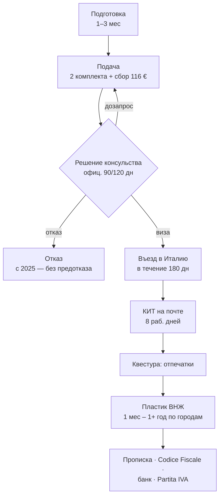
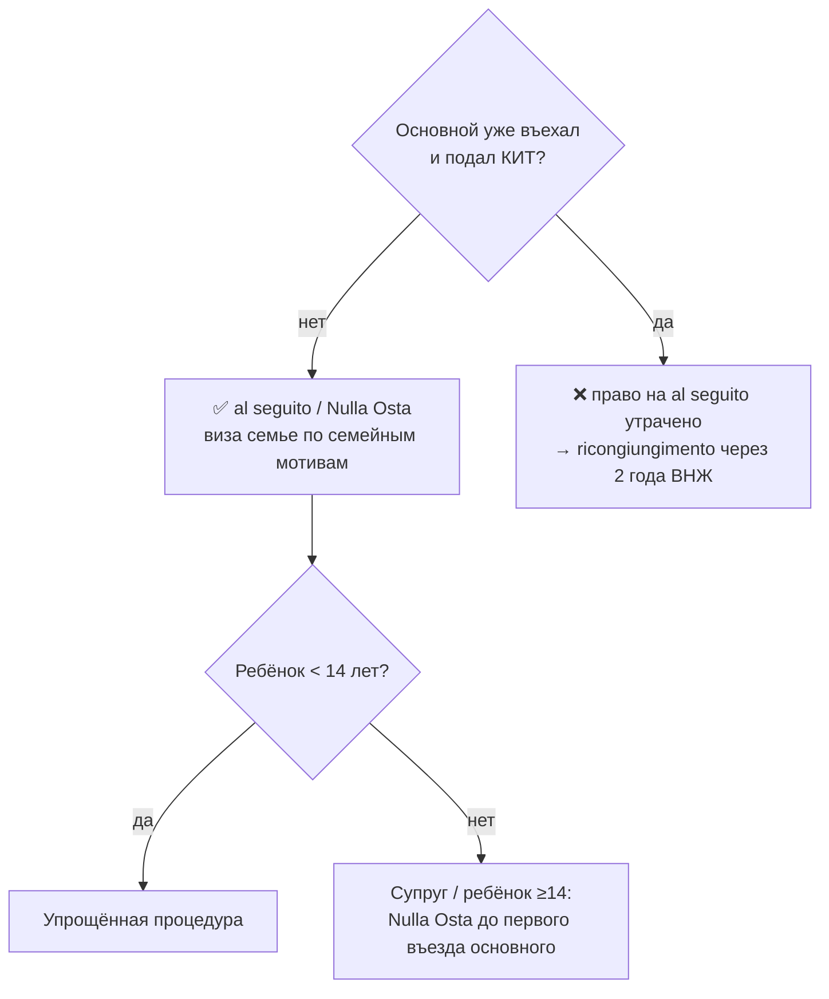
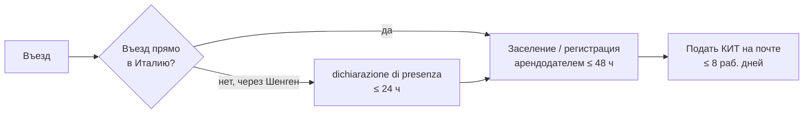
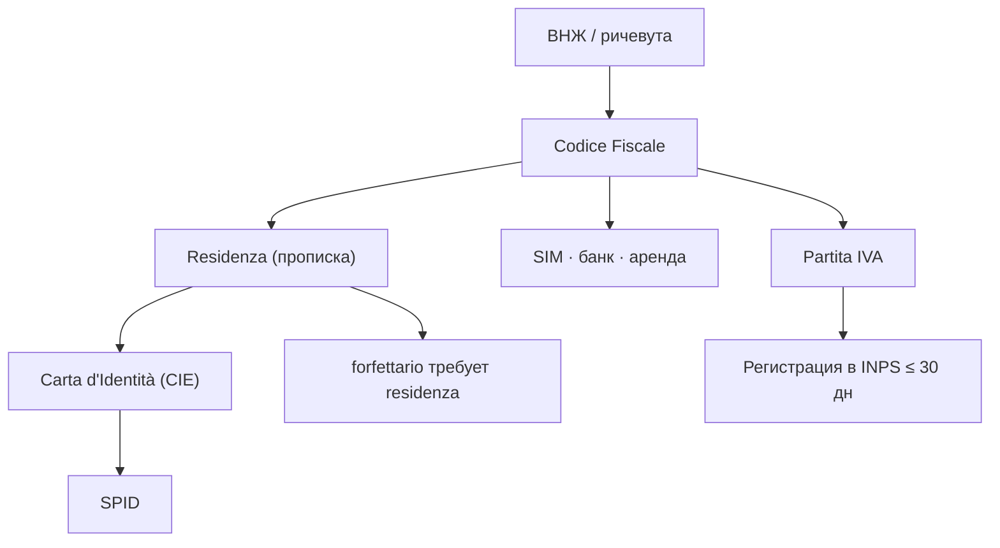
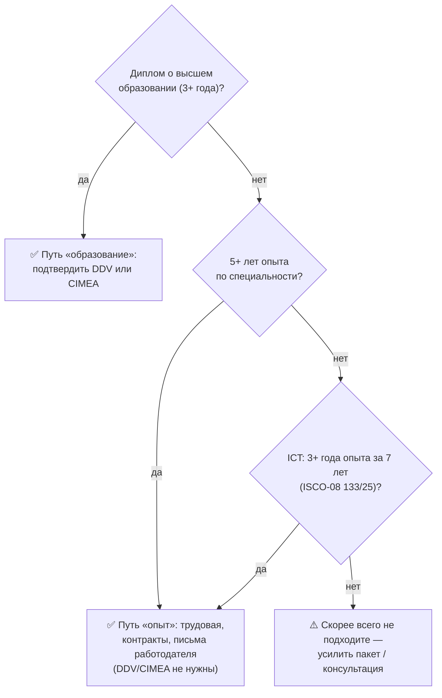
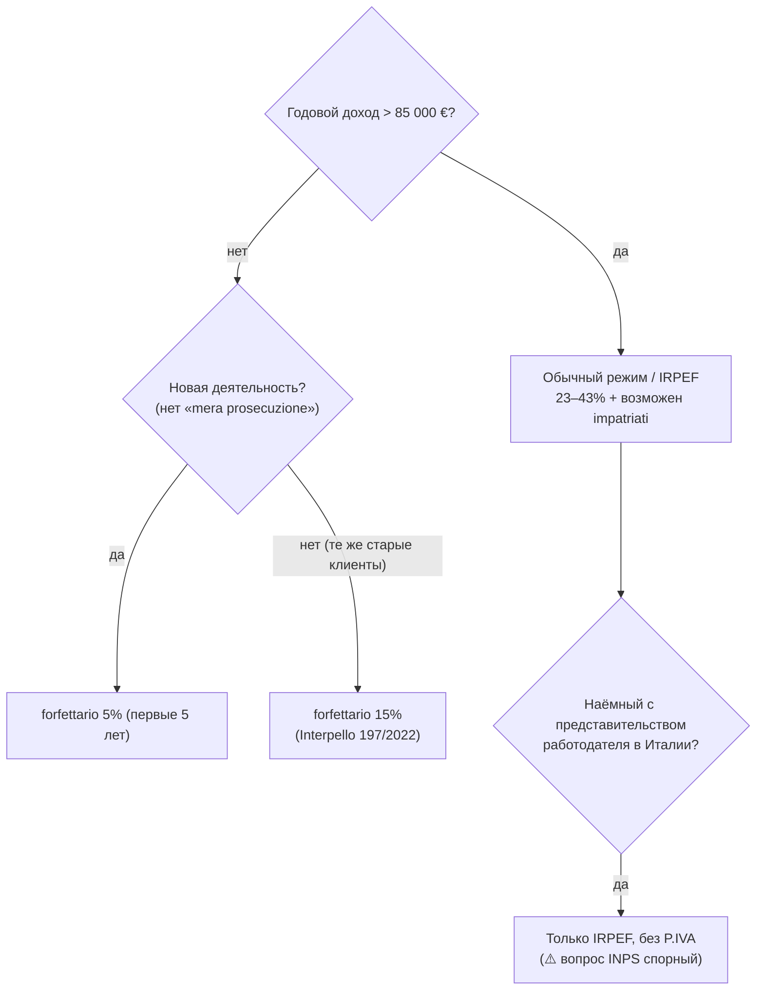
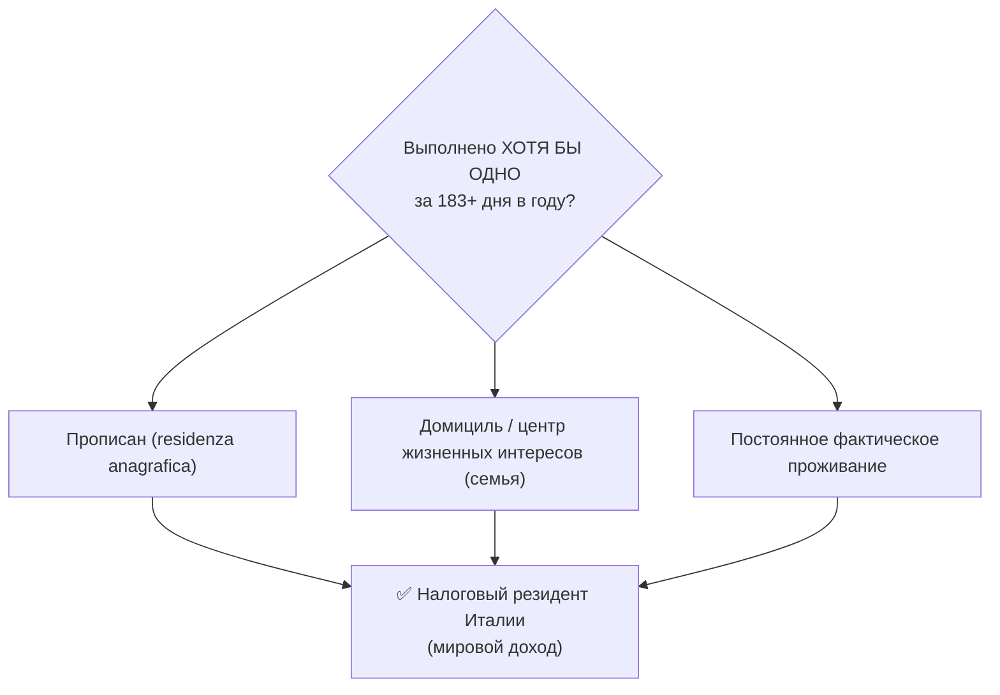
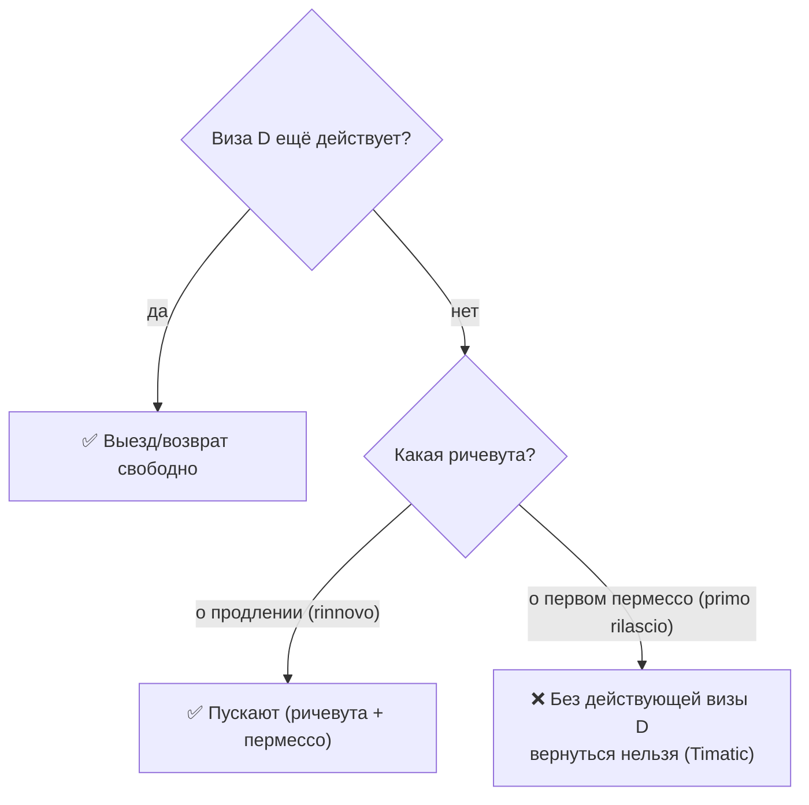

# Ревью гайда по визе цифрового кочевника — июль 2026

> Рабочий документ с находками и предложениями. Не часть гайда. Можно удалить после проработки.
> Метод: прочитаны все 23 файла (7 параллельных проходов по кластерам) + отдельный фактчек по официальным источникам + 3 детерминированные проверки (якоря, рассинхрон ссылок, нумерация H1) скриптами.

## TL;DR — что чинить в первую очередь

**Быстрые механические правки (низкий риск, высокая отдача):**
1. **Нумерация H1 сломана в 9 файлах** (04, 08, 10, 11, 15, 17, 18, 19, 20) — заголовок несёт старый номер (налоги `# 9.`, консульства `# 6.`…). Реликт прошлой ренумерации.
2. **1 битый якорь** из 317: [07-documents-employed.md:150](07-documents-employed.md:150) → `05#ddv-для-наёмных` (такого якоря нет).
3. **18 Telegram-ссылок** с рассинхроном подпись↔URL (текст `#1528` → URL `/8406`) в 02/05/06 + `17:82` (текст `nomadvisaitaly`, URL `ne_putai`).
4. **Битый домен** [20-useful-links.md:37](20-useful-links.md:37): `ambtiblisi` → `ambtbilisi`.
5. **2 неверных таргета** ссылок в 21-costs (билет → должно быть 05, а не 06; €20k → 11, а не 18-cases).

**Содержательные (нужно решение автора):**
6. **Аудит 🔴** (главный запрос): ~20–25 из 76 🔴 поставлены по «важности/страшности», а не по неоднозначности → должны быть 🟡. Плюс обратные ошибки (🟡 там, где реально 🔴). Раздел 2.
7. **🟢 массово стоит на пересказе закона из чата** (~30+ случаев) — по правилам это 🟡. Раздел 2.
8. **Фактическая ошибка**: противоречие в расчёте дохода для семьи ([03:32](03-family-decision.md:32) множители 50%/25% vs официальный ×3 — вчетверо расходятся по ребёнку). Раздел 5.
9. **Реструктуризация от общего к частному** нужна в 15-taxes, 04-preparation, 16-family, 12-first-steps, 13-settling. Раздел 1.
10. **Флоучарты** (12+ кандидатов, готовые Mermaid). Раздел 3.

---

## 1. Информационная архитектура (цели: логичнее, от общего к частному, переструктурировать)

### 1.1. Порядок файлов и README

Файловая структура (Части I–IV) в целом логична. Две проблемы:

- **Скачок нумерации в README.** Разделы 22–23 («Жизнь в Италии») стоят в оглавлении *перед* справочником 18–21, поэтому порядок чтения по README (…17 → 22 → 23 → 18–21) расходится с линейной навигацией в футерах (17 → 18 → … → 23). Это следствие конвенции «дописывать в конец, не перенумеровывать» (оправданной — переименование 18-cases сломало бы десятки ссылок). **Варианты:** (а) оставить как есть, но в README явно пометить, что 18–21 — сквозной справочник, а не следующий шаг; (б) добавить «карту гайда» (флоучарт, см. 3.15), которая снимает путаницу визуально.
- **README FAQ-таблица** не покрывает частые вопросы **страховка (08)** и **жильё (09/14)** — добавить 2 строки.

### 1.2. Нумерация H1 (системный баг, 9 файлов)

Заголовок `# N. …` не совпадает с номером файла/README:

| Файл | Сейчас H1 | Должно быть |
|------|-----------|-------------|
| 04-preparation | `# 5.` | `# 4.` |
| 08-insurance | `# 11.` | `# 8.` |
| 10-consulates | `# 6.` | `# 10.` |
| 11-application | `# 7.` | `# 11.` |
| 15-taxes | `# 9.` | `# 15.` |
| 17-renewal | `# 13.` | `# 17.` |
| 18-cases | `# 15.` | `# 18.` |
| 19-helpers | `# 16.` («Помощь») | `# 19.` («Помогаторы»?) |
| 20-useful-links | `# 14.` | `# 20.` |

Заодно: H1 файла 19 называется «Помощь», а вся навигация/README — «Помогаторы». Свести к одному названию.

### 1.3. Реструктуризация внутри файлов (от общего к частному)

**15-taxes.md — сильнее всего нарушает принцип.** forfettario раздроблен на 3 места (стр. 60, 285, 293), режимы вперемешку с наёмными и двойным налогообложением, резидентство разорвано (35 и 339), IRPEF продублирован (162 vs 325). Предлагаемый порядок:
> Интро/AI-обзор → Резидентство (35+339) → **Режимы одним блоком** [Forfettario (60+285+293) → Impatriati (138) → Совместимость (242) → Обычный+IRPEF (158+162+325)] → Наёмные (164+343+347+351) → Двойное налогообложение (215) → INPS (333+355) → Штрафы → Ведение P.IVA → Prima casa → Российская специфика.

**04-preparation.md** — DDV в 3 местах (127, 193, 260-CIMEA); частные «Апостиль диплома» идут до общего «Порядок документооборота»; внутри лежит полный кейс (244-258, место в 18-cases); дублируется с 06/07 («подтверждение опыта», 201-232). Файл большой, но по конвенции **не дробить** — сделать реордер: с чего начать + порядок + таймлайн → апостиль → перевод → DDV/копии/CIMEA (вместе) → консульское заверение → физ/эл. документы → стоимость. Блоки «подтверждение опыта» вынести в 06/07.

**16-family-process.md — структура сломана.** Открывается с H3 без родительского H2; «Вариант 2» без «Варианта 1» (тот физически в 03); **битая внутритекстовая ссылка [16:38](16-family-process.md:38) «см. Вариант 1 выше»** (в этом файле его нет); двойная таксономия «Вариант 1/2» ⟷ «Путь 1/2/3»; доход для воссоединения закопан в «Нюансы». Поднять открытие до H2, унифицировать терминологию, вынести доход в отдельный `## Доход для воссоединения`, `см. Вариант 1 выше` → ссылка на 03.

**12-first-steps.md** — «Шаг 3» разросся до ~180 строк с 15 H3. «KIT: тип пермессо» (207) и «KIT: Модуль 2» (211) относятся к Шагу 2 (заполнение KIT), а не к процедурам квестуры. Тайминги по городам разбиты на 3+ блока (120, 132, 149) — консолидировать.

**13-settling-in.md — порядок шагов противоречит зависимостям.** «Коротко» декларирует цепочку `ВНЖ → Codice Fiscale → Residenza → …`, но секции идут Прописка (Шаг 4) **раньше** Codice Fiscale (Шаг 5), хотя сам текст (стр. 78) говорит, что для резиденции нужен CF. Плюс две записи про резиденцию (78, 80) лежат под секцией Codice Fiscale. Переставить.

**08-insurance.md** — парные разделы «Какая подходит» и «Какие НЕ подходят» разорваны; узкая ветка «страховка для пожилых родителей» (67) рвёт поток (увести в 16); большой блок «Тессера санитария» (81–113) дублирует 22-healthcare — оставить в 08 «для визы», тессеру после ВНЖ увести/сослаться в 22.

**09-housing-for-visa.md** — весь файл под одним H2, **нет блока «Содержание»** (единственный такой). Разбить на под-H2: По консульствам / Оспиталита / Контракт и регистрация / Жильё для КИТ-ВНЖ / Воссоединение.

**10-consulates.md** — организация по странам логична, но **нет сводной матрицы-обзора в начале** (главный пробел, см. 3.12); дубль H2 «Турция — Анкара» (270 и 280, второй без маркеров/источников); «Кипр» как отдельный H2 ради одной строки (перенести в «Другие страны»).

**02-eligibility.md** — два почти одинаковых H2: «Кому DN виза может не подойти» (115) и «Кто не подходит» (119) — объединить; секция дохода B раздута (8 🟡-заметок с пересечениями) — сгруппировать в 4 блока.

**01-overview.md** — «Ключевые преимущества» (механика визы) логичнее до «Долгосрочные перспективы» (будущее); строки 54/56 (al seguito, «нельзя работать на работодателя в Италии») сидят под «тип 2 — наёмный», хотя относятся к DN в целом.

**11-application.md** — H2 «Обязательно ли конвертировать в ВНЖ» (250) не соответствует содержанию (1 строка); блок «Типы визы» (242–248) — eligibility-контент, место в 01/02.

**23-children-education.md** — **нет секции про государственные (бесплатные) школы** — дефолтный вариант большинства невидим, хотя упомянут в «Коротко». Добавить хотя бы stub `## Государственные школы`.

**17-renewal.md** — нет ни слова про тессеру/страховку при продлении (болевая точка, см. 22); «Предупреждение о мошенниках» (132) к продлению не относится.

---

## 2. Аудит маркеров надёжности (цель: проверить валидность, особенно 🔴)

Всего: **154 🟢 / 726 🟡 / 76 🔴**. Соотношение здоровое (🟡 — дефолт). Но есть системные ошибки в обе стороны.

### 2.1. 🔴, которые должны быть 🟡 (главная находка)

Правило: 🔴 = **неоднозначность** (противоречие источников / разные исходы у разных людей / непроверенный слух), НЕ важность/страшность. Единичный факт по одному городу/консульству и строгое предупреждение с одним исходом = 🟡.

**Явная ошибка (не «спорно», а решённый факт):**
- [10-consulates.md:67](10-consulates.md:67) — «Электронная виза с июня 2026 — фейк». Это **опровергнутый** слух с ссылкой на официальное опровержение esteri.it. Информация решённая, не спорная → 🟡 (или даже 🟢 по офиц. опровержению).

**🔴 → 🟡 (единичный факт/предупреждение с одним исходом):**

| Строка | Суть | Почему 🟡 |
|--------|------|-----------|
| [01:146](01-overview.md:146) | отказ без предотказа (ст. 10-бис) | однозначное правило, один исход |
| [03:59](03-family-decision.md:59) | потеря al seguito после въезда | строгое предупреждение, один исход (лучше 🟡⚠️) |
| [08:69](08-insurance.md:69) | страховка для родителей 65+ | единичный процедурный факт |
| [08:77](08-insurance.md:77) | «трюк» помесячной оплаты SafetyWing | единичный лайфхак с оговоркой (🟡⚠️) |
| [09:42](09-housing-for-visa.md:42) / [14:161](14-housing-italy.md:161) | сертификат жилья Милана | единичный факт по одному городу |
| [09:48](09-housing-for-visa.md:48) / [14:167](14-housing-italy.md:167) / [20:38](20-useful-links.md:38) | Белград требует контракт | твёрдое требование одного консульства, один исход |
| [10:55](10-consulates.md:55) / [11:72](11-application.md:72) | замедление в Москве 2026 | наблюдаемая статистика/тренд, не спор |
| [10:199](10-consulates.md:199) | Тбилиси не отвечает | один консулат, один исход |
| [10:264](10-consulates.md:264) | ospitalità в Белграде рискованна | согласуется со всеми данными о Белграде |
| [10:340](10-consulates.md:340) | Индонезия не отвечает | один консулат, один исход |
| [10:352](10-consulates.md:352) | не рекомендуют Будапешт | негативная рекомендация, одно направление |
| [13:72](13-settling-in.md:72) | риск фейкового codice | перечень предсказуемых рисков |
| [13:106](13-settling-in.md:106) | N26 отказывает при коротком ВНЖ | единичный кейс одного банка |
| [13:140](13-settling-in.md:140) | SPID/CIE без итал. документов не получить | однозначное правило |
| [13:150](13-settling-in.md:150) | не ввозить авто на росс. номерах | строгий совет, один исход |
| [15:130](15-taxes.md:130) | пост-СНГ и 5% forfettario | правило/условие с предсказуемым исходом |
| [15:213](15-taxes.md:213) | Милан: на продлении требуют ИП | единичный кейс (борд.) |
| [20:42](20-useful-links.md:42) | проблемы квестуры Генуи | единичный негативный опыт |

**Пограничные (защитимы как 🔴, но ближе к 🟡):** [10:177](10-consulates.md:177)/[11:101](11-application.md:101) (отказы Ереван), [10:201](10-consulates.md:201)/[11:122](11-application.md:122) (Тбилиси произвол), [12:181](12-first-steps.md:181) (возврат по ричевуте), [13:68](13-settling-in.md:68) (кодиче без пермессо), [13:86](13-settling-in.md:86) (SIM без кодиче), [15:211](15-taxes.md:211) (устные INPS).

**Итого:** ~18 явных + ~6 пограничных 🔴 → кандидаты в 🟡.

### 2.2. 🔴 поставлены ВЕРНО (не трогать)

Настоящая неоднозначность: [02:98](02-eligibility.md:98), [02:133](02-eligibility.md:133), [04:191](04-preparation.md:191), [05:131](05-documents-common.md:131), [07:46](07-documents-employed.md:46), [08:111](08-insurance.md:111), [10:138](10-consulates.md:138), [10:159](10-consulates.md:159), [11:28](11-application.md:28), [11:228](11-application.md:228), [11:230](11-application.md:230), [11:236](11-application.md:236), [12:102](12-first-steps.md:102), [12:104](12-first-steps.md:104), [12:257](12-first-steps.md:257), [13:96](13-settling-in.md:96), [15:48](15-taxes.md:48), [15:166](15-taxes.md:166), [15:244](15-taxes.md:244), [15:291](15-taxes.md:291), [15:301](15-taxes.md:301), [15:353](15-taxes.md:353), [15:355](15-taxes.md:355), [16:56](16-family-process.md:56), [16:112](16-family-process.md:112), все 🔴 в 22-healthcare (28, 38, 40, 52, 128), и все 🔴 в 19-helpers (по конвенции = негативный отзыв).

### 2.3. Обратная ошибка: 🟡, которые должны быть 🔴

- [08:95–101](08-insurance.md:95) — «В Турине тессеру выдали / в Тренто отказали» = разные исходы по регионам. Это **эталонный пример 🔴 из CLAUDE.md** («Милан дают / Трентино платно → 🔴»), но помечено 🟡.
- [16:144](16-family-process.md:144) — текст сам называет себя «спорным» + два противоположных совета → 🔴.
- [13:52](13-settling-in.md:52) — «результат зависит от офиса/сотрудника» (разные исходы), но 🟡, при том что аналогичный 13:68 — 🔴.

### 2.4. 🟢 на пересказе закона из чата (системная ошибка, ~30+ строк)

Правило: 🟢 — только официальный **первоисточник** (Gazzetta, сайт госоргана). Пересказ закона в чате без ссылки на первоисточник = 🟡. Массово нарушается:

- **01:** 62; **02:** 19, 82, 135; **03:** 18, 20, 51; **04:** 97, 99, 169; **05:** 20, 30; **06:** 21, 68; **07:** 44 (текст декрета цитируется из `rutoitalychat` — эталонный анти-паттерн), 79, 97, 129; **09:** 26, 40, 44; **10:** 142, 254, 344, 401; **11:** 44, 190, 226, 238, 246, 248; **13:** 70; **15:** 150, 162, 209, 283, 311, 335, 337; **16:** 21, 134, 138; **17:** 120, 130.

**Два пути:** (а) понизить до 🟡; (б) оставить 🟢, но заменить/добавить ссылку на реальный первоисточник (Normattiva/Gazzetta/Agenzia). Для ключевых правовых фактов предпочтителен (б) — заодно повышает доверие.

### 2.5. Прочее по маркерам

- **Двойные маркеры** в одной строке (маркер и у текста, и перед источником) — 18 строк, батч в 04 (77, 97, 99, 115, 145, 163, 169, 171) и 08 (79, 83, 101, 127). В 04:171 они ещё и разные (🟡 текст / 🟢 источник). Почистить.
- **21-costs.md — ни одного маркера во всём файле.** Нарушает правило «каждый факт маркируется». Проставить минимум 🟡.
- **⚠️ без маркера надёжности:** [22:42](22-healthcare.md:42) — ⚠️ не заменяет 🟢/🟡/🔴.

### 2.6. Рекомендация по конвенции 🔴

Корень путаницы: 🔴 используется в трёх смыслах — «спорно» (правильно), «негативный отзыв о помогаторе» (задокументировано для 19-helpers) и «проблемное консульство / важное предупреждение» (не задокументировано). Предлагаю:
- Держать **🔴 = только «спорно/неоднозначно»** (как в правилах).
- Для строгих предупреждений с одним исходом использовать **🟡 + ⚠️** (правила это уже разрешают).
- В README явно оговорить, что в 19-helpers 🔴 = негативный отзыв (сейчас читатель об этом не знает).

---

## 3. Флоучарты и диаграммы (цель: предложить визуализацию)

Гайд — на GitHub-markdown, поэтому оптимальный формат — **Mermaid** (рендерится нативно) и таблицы-матрицы. Готовые к вставке диаграммы — ниже, по приоритету.

**Тип «блок-схема процесса»**

**3.1. Общая схема процесса (01, заменить/дополнить ASCII).** Текущий ASCII линейный; добавить ветки «дозапрос» (петля) и «отказ».

**3.4. Воссоединение семьи (16/03) — распутывает «Вариант 1/2» + «Путь 1/2/3».**

**3.11. Первые дни — дедлайны (12, верх).** Сейчас проза; 24 ч / 48 ч / 8 дней легко перепутать.

**3.8. Граф зависимостей обустройства (13) — снимает путаницу порядка Шаг 4/5.**

**Тип «дерево решений»**

**3.2. Подхожу ли я? (02, секция A) — 4 варианта квалификации, «достаточно одного».**

**3.5. Выбор налогового режима (15) — сейчас размазан по стр. 60/138/158/301.**

**3.6. Налоговое резидентство (15) — снимает 🔴 [15:48](15-taxes.md:48).**

**3.9. Выезд/возврат в ожидании ВНЖ (12, стр. 171–185) — самый опасный кусок.**

**Тип «таблица-матрица» (Mermaid не нужен, но визуально ценно):**

- **3.12. Сводная матрица консульств (10, в начало — главный пробел).** Колонки: `Консульство · Резидентство для подачи · Жильё (букинг/контракт/оспиталита) · DN принимают? · Типичный срок · Заметки/дата`. Прямо отвечает на «что по моему консульству».
- **3.3. Сравнение двух типов визы (01).** `Критерий × [Nomade Digitale | Lavoratore da Remoto]`: кто подходит, работодатель, порог дохода (24 789 vs 33 500), тип контракта, nulla osta.
- **3.5-табл. Сравнение налоговых режимов** (дополняет дерево 3.5): `forfettario / impatriati / обычный × [льгота по базе · ставка · лимит дохода · INPS · кому]`.
- **Сравнение SSN vs частная страховка (22)** — сейчас проза.
- **Типы контрактов аренды (14): 4+4 / 3+2 / краткосрочный** × [требования · налоги владельца · защита арендатора].

**Тип «таймлайн»:**
- **3.10. Подготовка документов (04)** — горизонтальный таймлайн «Неделя 1 → 9+» с параллельными дорожками (консульские записи ‖ апостиль/справки ‖ переводы) и акцентом «запись на DDV = бутылочное горлышко».
- **3.13. Продление ВНЖ (17)** с городской развилкой «от какой даты считают срок» + лестница ВНЖ → ПМЖ (5 лет) → гражданство (10 лет).
- **3.15. README — «карта гайда» + таймлайн всего пути** (снимает путаницу порядка 18–23; показывает Решение → Документы → Подача → После приезда → Жизнь, справочник — сбоку).

**Тип «диаграмма расходов»:**
- **3.14. 21-costs — waterfall/стек по фазам:** «Виза (~100k ₽)» → «Переезд Милан (~€15k)» → «+Семья (~€6k страховка + …)». Наглядно: жильё/переезд кратно дороже самой визы. (На GitHub — таблицей с накопительным итогом или Mermaid `pie`.)

---

## 4. Кросс-линки (цель)

### 4.1. Целостность якорей — отлично
Из **317** внутренних якорных ссылок битая **1**: [07:150](07-documents-employed.md:150) → `05-documents-common.md#ddv-для-наёмных` (нет такого якоря; ближайший `#ddv-когда-нужна-когда-нет`). Все ссылки 19-helpers → 18-cases резолвятся; порядок кейсов (новые→старые) и сортировка помогаторов по числу кейсов — корректны.

### 4.2. Рассинхрон подпись↔URL Telegram-ссылок (18 шт.)
Подпись показывает один номер, URL ведёт на другой: 02 (57, 82×2, 90, 92, 99×2, 101), 05 (28, 137, 145), 06 (21, 32, 47, 56, 58, 73×2). Плюс [17:82](17-renewal.md:82) — подпись `nomadvisaitaly`, URL `ne_putai`. Читатель видит неверный номер источника → привести подпись к URL (или наоборот).

### 4.3. Отсутствующие полезные ссылки (высокая ценность)
- **15-taxes → ни одной исходящей ссылки.** Добавить: P.IVA/CF → 13; КИТ 8 дней → 12; доход для продления → 17; страховка → 08; commercialista → 19.
- **08 «Тессера» ↔ 22-healthcare** — темы дублируются, связи нет (критично).
- **[16:38](16-family-process.md:38) «см. Вариант 1 выше» → 03** (сейчас мёртвая внутритекстовая ссылка).
- **17 ↔ 22** (тессера/страховка при продлении); **11 ↔ 12** (передвижение/выезд в ожидании ВНЖ); **11/12/17** (конвертация пермессо — в трёх местах, ноль связок).
- 01/02 (доход) взаимные; 09→16; 10→04/19; 22→23 (прививки).

### 4.4. Дублирование контента между файлами (риск рассинхрона)
Один факт живёт в 2+ местах, редактируются независимо и уже расходятся:
- **08 «Тессера» ↔ 22** — 08 пессимистичнее («не положена без ИП, €2000»), 22 новее («с INPS бесплатно»); **🔴-предупреждение о штрафе [08:111](08-insurance.md:111) отсутствует в 22**. Сделать 22 каноном.
- 04 «подтверждение опыта» ↔ 06/07; 05/07 DDV; **20-useful-links дублирует профили из 19-helpers**; пороги дохода (01/02/03/06/07/11); 🔴-дубли (07↔15, 09↔14, 10↔11).
Держать канон в одном месте + ссылки.

---

## 5. Фактчек и «обзоры от AI» (цель: где проверить + добавить AI-обзор)

### 5.1. Внутренние противоречия и вероятные ошибки (найдены при чтении)
- **Доход для семьи — противоречие в одном файле.** [03:32](03-family-decision.md:32) «множители 50%/25%» (+12 394 € супруг, +6 197 € ребёнок) vs официальный ×3 в [03:26–30](03-family-decision.md:26) и [03:43](03-family-decision.md:43) (+9 297 € супруг, +1 548 € ребёнок — **вчетверо меньше**). Строка 43 сама считает по официальной формуле, игнорируя 32. Скорее всего 32 — устаревшая ошибочная трактовка из чата 2024; вынести в примечание/исправить.
- **Номер статьи о правиле 2 лет:** [16:19](16-family-process.md:19) «ст. 29 п.1-bis» vs [16:21](16-family-process.md:21) «Art. 28 п.1-bis». Один закon, разные статьи.
- **[07:115](07-documents-employed.md:115)** «Россия **отменила** статьи о двойном налогообложении» — фактически указом 2023 отдельные положения СИДН **приостановлены**, не отменены.
- **Апостиль диплома:** [04:68](04-preparation.md:68) «Минобрнауки» vs [04:79](04-preparation.md:79) «департамент образования региона».
- **Ставка INPS gestione separata** в 15-taxes: 26% / 26,07% / 26,3% в разных строках — свести к одной.
- **[15:150](15-taxes.md:150)** 🟢 «forfettario и impatriati не совместимы» прямо противоречит [15:244](15-taxes.md:244) 🔴 «спорно, суд 2024 допустил».
- **Сроки Москвы устарели:** [20:34](20-useful-links.md:34) «2–8 недель» (запуск 2024) vs реальность 2026 (4–8 мес, [10:55](10-consulates.md:55)).
- **Цены переводчиков из одного источника #8406:** «в 10 раз» ([20:68](20-useful-links.md:68)) vs «~20%» ([19:225](19-helpers.md:225)) vs «примерно одинаковые» ([20:155](20-useful-links.md:155)).
- **«8 дней» vs «8 рабочих дней»** на КИТ — унифицировать (официально — giorni lavorativi).

### 5.2. Проверка по официальным источникам

Проверено по официальным источникам (декрет 29.02.2024 — полный текст, Agenzia delle Entrate, консульства .esteri.it, Circolare AdE 20/2024).

| Факт из гайда | Вердикт | Что на самом деле |
|---|---|---|
| Декрет 29.02.2024; GU n.79 04.04.2024; в силе 05.04.2024; ст. 27 c.1 q-bis | ⚠️ почти верно | Даты и q-bis — верно. **`sexies.1` — ошибка, такой нормы нет.** Правильно: q-bis введена **art. 6-quinquies D.L. 4/2022 (Sostegni-ter)**, который декрет и цитирует. |
| **Доход ≈ 33 500 EUR (ISTAT) для наёмных** | ❌ **неверно** | В декрете (Art. 3) **одна формула для обоих типов**: «3× минимума освобождения от медрасходов» ≈ **24 789–28 000 EUR**. **Ни ISTAT, ни 33 500, ни отдельного порога для наёмных в декрете НЕТ.** Приштина: 3×8 500 = 25 500. Разброс реален → тема заслуживает 🔴 с диапазоном. |
| Страховка: покрытие 30 000 EUR | ⚠️ неточно | Декрет требует лишь покрытие «cure mediche e ricovero» на весь срок, **без фиксированной суммы**. 30 000 EUR — шенгенская норма для **краткосрочных** виз (Reg. 810/2009), консульства применяют по аналогии. Пометить как практику, не норму декрета. |
| Консульский сбор 116 EUR (виза D) | ✅ верно | Нац. виза D (91–365 дн) = 116 EUR, актуально 2026. |
| forfettario: 85 000; 5%/15%; mera prosecuzione (Interpello 197/2022); 3 года | ✅ верно | Legge di Bilancio 2026 подтвердила 85 000 и ставки 5%/15%. Interpello 197/2022 трактован верно. Доп.: лимит дохода найма/пенсии для доступа поднят до 35 000. |
| impatriati (D.Lgs 209/2023, с 2024) | ✅ верно | Освобождение **50%** (или 40% с ребёнком), потолок **600 000 EUR**, срок 5 лет, не быть резидентом 3 пред. периода. Применим к наёмным и профи-фрилансерам. **Несовместим с forfettario** + требует «высокой квалификации» и работы преим. в Италии. |
| Правило 180 дней НЕ в декрете/TU | ✅ верно | В тексте декрета «180 giorni» **нет**. Окно первого въезда задаётся полем «validità» визы — админпрактика, не кодифицированная DN-норма. Скепсис гайда обоснован. |
| Резидентство: 183 дня + ст. 2 TUIR | ✅ верно (+ обновления 2024) | С 01.01.2024 (D.Lgs 209/2023): добавлен критерий **физического присутствия** (считая доли суток); **domicilio переопределён** через личные/семейные связи; прописка (anagrafe) — теперь **опровержимая** презумпция. |

**Что править в гайде по итогам фактчека (Волна 3):**
- **Порог дохода** — самое важное. Не удаляя 🟢-строки VMS (по решению — 🟢 не трогаем), **добавить 🔴-примечание**: декрет даёт единую формулу ~24 789–28 000 € для обоих типов; 33 500 (ISTAT) — трактовка VMS Москва для наёмных, практика расходится → это спорный момент с диапазоном. Затрагивает [01:52](01-overview.md:52), [02:72/76](02-eligibility.md:72), [07:28/79](07-documents-employed.md:28).
- `sexies.1` → `art. 6-quinquies D.L. 4/2022` в [01:19](01-overview.md:19).
- Страховое покрытие 30 000 € (если фигурирует как норма) → пометить «шенгенская норма по аналогии, не требование DN-декрета» ([08-insurance](08-insurance.md)).
- Добавить в 15-taxes: forfettario ↔ impatriati **несовместимы** (это разрешает внутреннее противоречие [15:150](15-taxes.md:150)↔[15:244](15-taxes.md:244)); impatriati требует «высокой квалификации»; обновления резидентства-2024.

*Замечание среды: `gazzettaufficiale.it` отдавал ECONNRESET (вероятно гео-блок для не-ЕС IP); текст декрета сверен по зеркалу PDF piemonteimmigrazione.it + консульским сайтам. Финальную сверку первоисточника лучше сделать с ЕС-IP.*

### 5.3. Кандидаты на «обзор от AI»
Сжатая вводная врезка `> 🤖 Обзор` (с явной оговоркой «сверяйте с первоисточником/специалистом») уместна там, где данные разбросаны по десяткам заметок:
1. **15-taxes, начало** — карта «резидентство → выбор режима → ставки» + таблица сравнения режимов. **Наивысшая ценность.**
2. **10-consulates, начало** — статус-обзор + матрица консульств с датами.
3. **02, секция дохода** — «ИП ~24 789 / найм ~33 500 за прошлый год; большой остаток не нужен; валюта любая».
4. **04, начало** — пайплайн подготовки с акцентом на бутылочное горлышко (запись на DDV/заверение).
5. **11, правило 180 дней** — свод «что известно / чего нет в законе / безопасный ориентир».
6. **13, codice fiscale без пермессо** — итог одним абзацем.
7. **16** — таблица порогов дохода для воссоединения по размеру семьи.
8. **README** — обзор всего пути (таймлайн).

---

## 6. План действий (предлагаемая очерёдность)

**Волна 1 — механические, безопасные (могу сделать сразу пакетом):**
- H1-нумерация (9 файлов) · битый якорь 07:150 · 18 рассинхронов подпись↔URL · домен `ambtbilisi` · 2 таргета в 21-costs · дубль-маркеры (18 строк) · пустая секция «СПб» в 19-helpers · TOC-догрузка (19, 16) · «Содержание» в 09 · 2 строки в README FAQ.

**Волна 2 — маркеры** *(решение: 🔴→🟡 да; 🟢 НЕ трогать)*:
- Понизить ~18 явных 🔴→🟡 (раздел 2.1) · исправить 🔴-фейк 10:67 · поднять 3 🟡→🔴 (2.3) · проставить маркеры в 21-costs · оговорка про 🔴 в 19-helpers в README.
- **🟢 не трогаем** (раздел 2.4 остаётся как задокументированное наблюдение; при желании позже — добавить ссылки на первоисточник, не меняя маркер).

**Волна 3 — фактические правки** *(с учётом фактчека, раздел 5.2)*:
- **Порог дохода:** 🔴-примечание про декрет ~24 789–28 000 € vs VMS-33 500 (не трогая 🟢-строки) · `sexies.1`→`art. 6-quinquies D.L. 4/2022` · страховка 30 000 € как шенгенская норма по аналогии.
- Доход для семьи (03:32 множители 50%/25%) · номер статьи (16:19/21) · «приостановлены» (07:115) · ставка INPS · сроки Москвы (20:34) · цены переводчиков · «8 рабочих дней» · forfettario↔impatriati несовместимы.

**Волна 4 — реструктуризация (по файлам, крупнее):**
- 15-taxes · 04-preparation · 16-family · 12-first-steps · 13-settling · 08/09/10 · 01/02/11 · stub гос-школ в 23.

**Волна 5 — визуализация и кросс-линки:**
- Вставить приоритетные Mermaid (раздел 3) · добавить недостающие кросс-ссылки (4.3) · свести дубли к канону + ссылки (4.4).

**Волна 6 — AI-обзоры:**
- Врезки из 5.3, начиная с 15-taxes и 10-consulates.

---

## Статус реализации (сессия 12 июля 2026)

**Сделано и проверено** (0 битых якорей на каждом шаге; при перестановках множество строк сохранено побайтово):
- **Волна 1 (механика):** H1-нумерация ×9, битый якорь 07→05, домен `ambtbilisi`, 2 таргета в 21-costs, 17 двойных маркеров, заглушка «СПб», FAQ в README.
- **Волна 2 (маркеры):** 🔴 76→58 (−23 понижено до 🟡, +3 поднято до 🔴, исправлен фейк-евиза 10:67); оговорка про 🔴 в помогаторах в README; маркеры в 21-costs. **🟢 не тронуты** (148 сохранены).
- **Волна 3 (факты):** порог дохода (🔴-примечание: декрет ~25–28к vs VMS 33.5к), `sexies.1`→`art. 6-quinquies D.L. 4/2022`, множители 50/25%, «приостановила» СИДН, страховка 30к = шенген-норма, ст. 28→**29** (веб-подтверждено), сроки Москвы, цены переводчиков.
- **Волна 4 (структура):** 15-taxes, 04, 08, 09, 12, 16, 23 — перенос H2-блоков скриптом + авто-перестановка «Содержания».
- **Волна 5 (частично):** дедуп тессеры 08↔22 (канон — 22, добавлено предупреждение о штрафе + взаимные ссылки).
- **Волна 6 (частично):** флагманский AI-обзор в начале 15-taxes.

Итого: **22 файла, +248/−211; маркеры 🟢148 / 🟡736 / 🔴58**.

**Довыполнено во 2-й итерации (по ответам автора):**
- **Флоучарты → Mermaid** (автор смотрит на GitHub): вставлены 4 дерева — 02 (квалификация «подхожу ли я?»), 12 (дедлайны первых дней), 15 (выбор налогового режима), 16 (пути воссоединения). Остальные из §3 — в запасе.
- **Ссылки:** исправлены все ID-рассинхроны (подпись под URL, т.к. «истина в ссылке») + канал 17:82 `nomadvisaitaly`→`ne_putai`. Подпись `emigrantista` **оставлена** (это конвенция CLAUDE.md, не ошибка). Рассинхронов номер≠URL: 0.
- **13-settling:** Codice Fiscale (Шаг 4) поставлен перед Пропиской (Шаг 5) по цепочке зависимостей; 2 записи про резиденцию перенесены в «Прописку». Внешних ссылок на якоря шагов не было — ничего не сломано.
- **Аудит сохранности контента:** 0 потерянных источников; строк-утверждений 914→917 (+3, только добавления). 323 якорные ссылки, 0 битых.

**Осталось (одобрено, но не сделано — межфайловые переносы, самый рискованный тип):**
- **04 «подтверждение опыта» → 06/07** — требует проверки на дублирование (агент отметил пересечение с 06/07): не «слепой» перенос, а дедуп канона. Держу на отдельный аккуратный шаг, чтобы не создать дубли/потери.
- **Встроенный кейс из 04 → 18-cases** — нужно вписать в формат 18-cases (заголовок/дата/источник) и его оглавление (1709 строк).
- Остальные AI-обзоры (10-consulates, 02, 11) и кросс-линки из §4.3 — по желанию.
